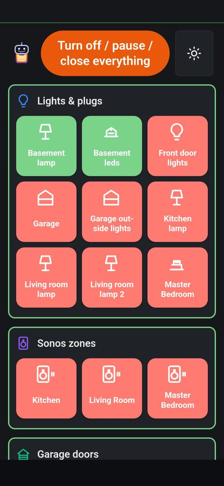

# domesti-bot

[](https://github.com/the-hcma/domesti-bot/actions/workflows/ci.yml)
[](https://pypi.org/project/domesti-bot/)
[](https://www.python.org/)
[](LICENSE)

A self-hosted home-automation control surface for the devices on your home
network. `domesti-bot` discovers and controls TP-Link Kasa smart plugs/lights,
Sonos zones, GoTailwind garage doors, and Vizio SmartCast TVs, then exposes them
through a tile-based web UI for one-tap control from any phone or laptop on the
same LAN.

A **file-backed rules engine** drives **Automations**: presence from
[my-tracks](https://github.com/the-hcma/my-tracks) (geofence enter/leave),
scheduled cron rules (dwell, device-state, once-per-day caps), Kasa actions, and
email notifications. Rule definitions live in `automation-rules.json` today;
edit the file and restart the server to change automations.

The project is intentionally narrow in scope: no mandatory cloud round-trips, no
vendor SaaS beyond what each device family already requires. Everything runs on
a single machine inside the network the devices are on — typically the same
Linux server that already hosts other always-on services.

## Features

- **TP-Link Kasa / Tapo (`python-kasa`)** — auto-discovery, on/off toggle per
  device, per-family "Turn off all", with sticky exclusions for devices you
  don't want bulk-actions to touch. Handles newer KLAP-encrypted devices via
  an interactive `kasa-creds` REPL command.
- **Sonos (`soco`)** — zone discovery, per-zone pause/resume, per-family
  "Pause all". Gracefully handles UPnP 701 ("Transition not available", e.g.
  empty queue) with a surfaced action-error toast in the UI.
- **GoTailwind garage doors** — open/close per door, "Close all", and
  idempotent operations so a "Close everything" bulk action survives doors
  that are already closed. The Tailwind Local Control Key can be stored
  encrypted in the discovery SQLite database (see [Encrypted secrets](#encrypted-secrets)).
- **Vizio SmartCast TVs** — power on/off per TV (Wake-on-LAN where supported).
  Configure TVs in desktop ☰ → **Settings**.
- **Automations (rules engine)** — `automation-rules.json` at the server root
  (template: `automation-rules.json.example`). Edge rules on geofence enter/leave;
  scheduled cron rules (sunset, dwell, device on/off, once-per-day). Kasa actions
  and optional email on fire. Desktop ☰ → **Automations** — see
  [Automations](#automations).
- **My Tracks presence** — pair with a my-tracks server for live location
  webhooks; sync user roster and geofence definitions into domesti-bot. See
  [`docs/MY_TRACKS_INTEGRATION_PLAN.md`](docs/MY_TRACKS_INTEGRATION_PLAN.md).
- **Encrypted secrets** — Fernet-encrypted values in SQLite (Tailwind token
  today); master key in gitignored `domesti-bot.config.json` at the repo root.
  Create it with the `setup-secrets` REPL command or copy
  `domesti-bot.config.json.example`.
- **Web UI** (`/`) — tile-based control, family-color frames, optimistic UI
  updates with an 8-second grace window, backend-connectivity status, mobile
  viewport support, and standardized colour rules (green active, red per-tile
  off, orange bulk actions). Talks to a stable, OpenAPI-typed HTTP surface under `/v1/…`.
- **REPL CLI** (`scripts/domesti-bot`) — same discovery / control surface
  exposed as an interactive `prompt_toolkit` shell for scripting and
  troubleshooting, including `setup-secrets` to create `domesti-bot.config.json`.
- **Continuous state monitoring** — background pollers keep tile state fresh
  (Kasa, Sonos, Tailwind, Vizio) without manual refresh.

## Quick start

Requires **Python ≥ 3.12** (3.14 is the targeted runtime).

### Install from PyPI (recommended)

Install from **[PyPI](https://pypi.org/project/domesti-bot/)** (`pipx` recommended):

```bash
pipx install domesti-bot
domesti-bot-server              # HTTP API + web UI on a free loopback port
domesti-bot-server --listen-all # LAN-visible bind for phone / tablet testing
domesti-bot                     # interactive REPL for troubleshooting
domesti-bot --version           # package version and source commit
```

Set `DOMESTI_API_KEY` when binding to the LAN or any network you do not fully
trust. See [Configuration](#configuration) below.

PyPI releases are built with the web bundle included; no Node.js is required at
runtime. See [`docs/RELEASING.md`](docs/RELEASING.md) for how maintainers publish.

### Develop from a git checkout

Uses [`uv`](https://docs.astral.sh/uv/) for dependency management.

```bash
git clone https://github.com/the-hcma/domesti-bot.git
cd domesti-bot
uv sync --group dev
cd web && pnpm install --frozen-lockfile && pnpm run build && cd ..

# Start the HTTP server (binds 127.0.0.1 on a free port; auto-opens browser)
./scripts/domesti-bot-server

# Or expose to the LAN so you can validate the UI from a phone
./scripts/domesti-bot-server --listen-all
```

The startup banner prints the URL the server is listening on, including one
`[http] network: http://<lan-ip>:<port>` line per non-loopback interface when
`--listen-all` is passed.

Need the device-control REPL instead of the HTTP API? Run
`./scripts/domesti-bot` and follow the prompts.

## Configuration

Most operation is zero-config — devices are discovered on the LAN via mDNS /
broadcast probes, and discovered configurations are persisted in an SQLite
cache (`~/.cache/rule-engine/device_discovery.sqlite` by default; override with
`--discovery-cache`) so subsequent startups are fast. Geofences, user roster,
encrypted secrets, and rule **fire state** live in the same database file.

### `domesti-bot.config.json`

Some features read a small gitignored JSON config file at the repo root:
`domesti-bot.config.json` (override with `DOMESTI_BOT_CONFIG_FILE`). A template is
committed at `domesti-bot.config.json.example`.

Supported keys:

- `domesti_secrets_key` (string): Fernet master key for encrypting secrets stored
  in SQLite (used when saving Tailwind tokens from the web UI). This must be a
  valid url-safe base64 Fernet key. Precedence: `DOMESTI_BOT_SECRETS_KEY` env →
  `domesti_secrets_key` in this file.
- `sonos_stream_favorites` (list): global radio stream favorites used when
  resuming Sonos playback.
  - Each favorite entry: `{ "name": "<label>", "uri": "<https://...>" }`.
  - Current behavior: resume uses the **first** favorite (`favorite_index = 0`).

Optional environment variables:

| Variable | Effect |
|---|---|
| `DOMESTI_API_KEY` | When set, every `/v1/…` endpoint requires the `X-Domesti-Api-Key` header. Unset = unauthenticated (intended for trusted LAN only). |
| `DOMESTI_AUTOMATION_RULES_FILE` | Path to the automation rule bundle (default: `./automation-rules.json` beside the config file). |
| `DOMESTI_BOT_CONFIG_FILE` | Override path to the config JSON file (default: `./domesti-bot.config.json` at repo root). |
| `DOMESTI_BOT_SECRETS_KEY` | Fernet master key for encrypted SQLite secrets. Overrides `domesti-bot.config.json` when set. |
| `DOMESTI_LISTEN_HOST` | Default bind address for the HTTP server. Overridden by `--listen-host` / `--listen-all`. |
| `DOMESTI_LISTEN_PORT` | Default TCP port. `0` = OS-allocated (the dev default). |
| `KASA_USERNAME` / `KASA_PASSWORD` | TP-Link cloud credentials for KLAP-encrypted devices (Tapo / newer Kasa). Required only if you have at least one such device. |
| `TAILWIND_TOKEN` | GoTailwind Local Control Key (six-digit code from the Tailwind dashboard). Overrides the encrypted DB copy when set. |

Pass `--help` to either script for the complete flag list.

## Encrypted secrets

Discovery state (device configs, display names, UI preferences, cached Tailwind
host, and similar) lives in a single SQLite file. **Upgrading domesti-bot does
not wipe that file** — existing rows keep working; new tables (such as
`app_secrets` for encrypted values) are added automatically on first access.

To encrypt secrets at rest (for example the Tailwind token saved from the web
UI), configure a Fernet master key:

1. Copy the template and generate a key (or use the REPL helper):

   ```bash
   cp domesti-bot.config.json.example domesti-bot.config.json
   # in the REPL: setup-secrets
   ```

   `setup-secrets` can generate a new key or accept an existing one, writes
   `domesti-bot.config.json` with mode `0600`, and reminds you to restart the
   server. The file is listed in `.gitignore` — never commit it.

2. Restart `domesti-bot-server` so the process reads the file.

3. On **desktop** browsers, open the **☰** menu → **Settings** and paste the
   six-digit Tailwind Local Control Key. It is stored encrypted in SQLite and
   is never shown again. Restart once more so discovery picks up the token.

**Precedence for the Tailwind token:** `--tailwind-token` → `TAILWIND_TOKEN`
env → encrypted row in SQLite. **Precedence for the Fernet key:**
`DOMESTI_BOT_SECRETS_KEY` env → `domesti_secrets_key` in `domesti-bot.config.json`.

For systemd, you can still use `EnvironmentFile=` for `TAILWIND_TOKEN` instead
of the database path; see [`docs/AGENTS.md`](docs/AGENTS.md) for security notes.

## Web UI overview

After starting the server, the landing page hydrates a tile UI:



*Compact mobile layout on a phone: family sections (green frame = connected), per-device tiles (green = on / playing, red = off / paused), and the global **Turn off / pause / close everything** control at the top.*

- One section per device family (`Lights & plugs`, `Sonos zones`,
  `Garage doors`, `Vizio TVs`) with a family-coloured icon and frame.
- One tile per device. Tap to toggle (on/off, play/pause, open/close); the
  tile updates optimistically and reconciles with the next background poll
  (every 5 seconds).
- Per-family bulk button (`Turn off all`, `Pause all`, `Close all`) and a
  global `Turn off / pause / close everything` button at the top (warm orange,
  distinct from red per-tile off controls).
- On **desktop** viewports, a **☰** menu with **Automations** (rules, geofences,
  users, mail), **Settings** (Tailwind, My Tracks, Vizio), and **About**.
  The menu is hidden on narrow mobile form factors (tiles + PWA install still work).
- Per-tile "Exclude from all-off" (and analogous) checkbox so the top-of-page
  bulk action skips devices you don't want it touching.
- Connectivity indicator: family frames turn red when the backend is
  unreachable; all controls grey out until the next poll succeeds.

## Progressive Web App (PWA)

The landing page is installable as a PWA on phones and desktops that support
it. Assets live under `app/api/static/`:

- `manifest.webmanifest` — name, icons, `display: standalone`
- `sw.js` — service worker (also served at `GET /sw.js` so scope covers `/`)
- `icons/` — launcher icons referenced by the manifest

The TypeScript bundle registers the worker on load. After you deploy a new
version, bump the service worker cache version in `app/api/static/sw.js` (currently
**`domesti-bot-pwa-v20`**) so installed clients pick up HTML, CSS, and
`dist/main.js` changes.

**Install requirements:** Chromium-based browsers need a secure context
(`https://` or `http://127.0.0.1`). On a plain HTTP LAN URL, you still get
manifest metadata in some browsers, but the install prompt may not appear until
you terminate TLS or use loopback. When the server is reachable with
`--listen-all`, open the dashboard from your phone at
`http://<server-lan-ip>:<port>/` and use the in-app install banner when
offered.

## Automations

Production automations are **file-backed** today:

1. Copy `automation-rules.json.example` → `automation-rules.json` beside
   `domesti-bot.config.json` (gitignored on your server).
2. Pair **My Tracks** (desktop ☰ → **Settings**) and sync **Users** / **Geofences**
   under ☰ → **Automations** so rule `user_id` and `geofence_id` values match.
3. Configure **Mail** under Automations if rules use `notify_on_fire`.
4. Edit `automation-rules.json`, then restart `domesti-bot-server` (or the
   systemd user unit).

**Triggers:** `edge_true` (fire on geofence enter/leave for the arriving user)
and `scheduled` (cron + conditions such as `after_sunset`, dwell, device on/off,
`fire_once_per_local_day`).

**UI:** desktop ☰ → **Automations** — live **Status** (per-condition ✓/✗),
read-only **Rules** inspector, **Geofences** map editor, **Users** roster, **Mail**.
In-UI rule editing is planned ([`docs/RULE_ENGINE_PLAN.md`](docs/RULE_ENGINE_PLAN.md)
Phase 2b).

**Docs:** [`docs/README.md`](docs/README.md) indexes operator and contributor
guides.

## Project layout

```text
domesti-bot/
├── app/                          Domain code (device managers, rule engine)
│   ├── *_device_manager.py       Per family (kasa, sonos, gotailwind, vizio, …)
│   ├── rule_evaluator.py         Automation evaluation (edge + scheduled)
│   ├── automation_rules_loader.py  Parse automation-rules.json
│   ├── db/                       SQLAlchemy models + encrypted secrets
│   ├── device_discovery_store.py SQLite cache facade (devices + rules state)
│   └── api/                      FastAPI HTTP surface (tiles, rules, webhooks)
├── automation-rules.json.example Committed rule bundle template
├── config/serve.py               uvicorn entrypoint
├── tests/python/                 pytest suite (hermetic + LAN-integration)
├── web/src/                      TypeScript (tiles + Automations hub)
├── scripts/domesti-bot           REPL CLI
├── scripts/domesti-bot-server    HTTP server launcher
├── production/                   systemd unit template + on-deploy hooks
├── docs/                         Operator plans + contributor guides (see docs/README.md)
└── docs/AGENTS.md                Developer reference (canonical)
```

`AGENTS.md` at the root is a symlink to `docs/AGENTS.md` — both paths point
to the same canonical developer reference.

## Development

```bash
# One-time setup
uv sync

# The full set of CI gates, in the order they run on every PR:
uv run pyright                       # type errors over app/, config/, scripts/, tests/
uv run pytest -m "not integration and not browser" -n auto   # hermetic (parallel; mirrors CI)
shellcheck $(git ls-files scripts production/scripts | grep -Ev '\.(py|md|txt|yml|yaml|json|toml)$')

# Frontend, when web/src/ is touched:
cd web
pnpm install --frozen-lockfile
pnpm run typecheck
pnpm run build                       # writes app/api/static/dist/main.js
```

The full set of code-style, testing, security, and Git workflow conventions is
documented in [`docs/AGENTS.md`](docs/AGENTS.md). Notable rules:

- Python 3.14 targeted, modern typing only (`list[str]`, not `List[str]`),
  every public function annotated, `pyright` enforced.
- `uv` for dependency management — never `pip` directly.
- Methods and module-level functions sorted alphabetically inside each class.
- Sigs require `from __future__ import annotations`.
- All commits via Graphite-stacked PRs; `main` is protected, direct pushes
  are blocked at the server.
- Conventional Commit messages, GPG-signed.

## Production deployment

The production target is a **systemd user unit**. The template at
[`etc/systemd/domesti-bot.service`](etc/systemd/domesti-bot.service)
is what
[`repository-helpers`](https://github.com/the-hcma/repository-helpers)
`setup-service` installs (same `@@REPO_DIR@@` contract as fpdf). It passes
`--listen-all --listen-port 8003` so the API listens on all interfaces (use
`DOMESTI_API_KEY` on untrusted LANs). `ExecStartPost` curls `GET /health` on
loopback until the process answers. The deploy hook [`scripts/on-deploy`](scripts/on-deploy)
runs `uv sync`, rebuilds the web bundle when needed, and lets `setup-service`
restart the unit. For a **system**-level unit with a dedicated user, see
[`production/systemd/domesti-bot-server.service.template`](production/systemd/domesti-bot-server.service.template).

`docs/AGENTS.md` has the deployment-specific details — auth keys, log paths,
service management commands.

## Contributing

**Contributions are welcome and appreciated.** Issues, bug reports, feature
requests, and PRs are all on the table — whether you've spotted a typo,
hit an edge case with your specific Kasa/Sonos/Tailwind hardware, or want to
add a brand-new device family, the door is open.

The project uses [Graphite](https://graphite.dev) for stacked PRs. The
practical workflow is:

```bash
# 1. Start a stack from main
gt create feat/your-idea

# 2. Make the change, run the local gates (pyright + pytest, see Development)
#    Each gate is also enforced in CI.

# 3. Commit + open PR
gt create --all --message "feat: short description"
gt submit --no-interactive --publish
```

For larger changes, stack the work into focused PRs so each one is
independently reviewable. The [stack of PRs](https://github.com/the-hcma/domesti-bot/pulls)
visible on this repo is itself an example of the pattern.

The full Git / commit / PR conventions, including the merge-it label flow and
the protected-`main` ruleset, live in [`docs/AGENTS.md`](docs/AGENTS.md) under
the *Commits, Stacking & Pull Requests* section.

## License

MIT License — see [LICENSE](LICENSE) for the full text. Copyright (c) 2026
Henrique Andrade.
