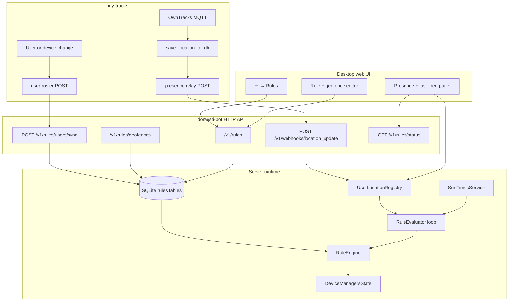
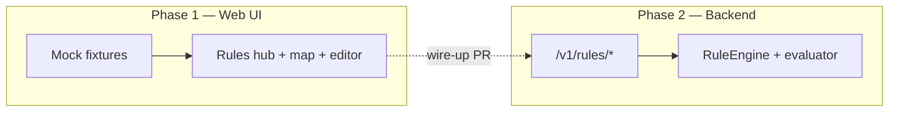

# Plan: mainline the rule engine

This document describes how to evolve domesti-bot from its **partially implemented** rule-engine scaffolding into a production-ready automation layer. The **first production automations** (file-backed, no rule SQLite yet):

> When **Henrique or Kristen** **arrives home** after sunset, turn on **Front door lights**, **Garage**, and **Garage outside lights**, and email **github@hcma.info**.
>
> When **Kristen arrives at** or **leaves** the **west-point** geofence, email **github@hcma.info** (no device actions).

See **`automation-rules.json.example`** at the repo root (copy to gitignored **`automation-rules.json`** on the server).

The rule engine UI lives on the **desktop web surface only** (☰ menu, viewport wider than the compact/mobile breakpoint). Mobile/PWA users keep the tile dashboard; they do not get rule editing in v1.

**Strategic shift:** server-side **global automation evaluation** currently lives in [my-tracks](../my-tracks) (`GlobalAutomationRule`, `_evaluate_global_automations_for_user`). That logic — geofence conditions, multi-user AND semantics, edge-triggered firing — **moves entirely into domesti-bot**. my-tracks becomes a **location ingest + map/tracking** service: MQTT → SQLite → presence webhook relay. Geofence **definitions** also move to domesti-bot (with a Leaflet + OpenStreetMap editor modeled on my-tracks’ `/geofences/` page).

**Nomenclature:** presence automation uses **user** + **location** terms (`user_id`, `user_ids`, `users_inside_geofence`, …) — see `.cursor/rules/presence-user-location-nomenclature.mdc`.

**my-tracks pairing and relay (canonical):** see [`docs/MY_TRACKS_INTEGRATION_PLAN.md`](MY_TRACKS_INTEGRATION_PLAN.md) for HTTPS public URLs, domesti-bot-initiated pairing, live vs test webhook paths (`/v1/webhooks/location_update` and `/v1/webhooks/location_update/test`), manual roster/geofence sync, verify roundtrip, and the emergency location-update switch. Sections below that describe a roster **push** webhook are superseded by manual **pull** sync in that plan unless noted otherwise.

**Delivery order:** Phase 1 (desktop Automations UI + mocks) is **largely shipped**. Phase **2a–2d** (file-backed evaluator, scheduled rules, dwell, device-state, once-per-day cap) are **shipped** — operators use `automation-rules.json` + restart. **Phase 2b** (SQLite rule CRUD + in-UI edit) is the next major track.

---

## Agreed design: file-backed evaluator (no rule persistence yet)

### Rule bundle file

| Item | Choice |
| --- | --- |
| **Path** | `automation-rules.json` at the **repo/server root** (beside `domesti-bot.config.json`). Committed template: `automation-rules.json.example`. |
| **Schema** | Same JSON shape as `RuleOut` / `RuleConditionOut` in `web/src/types.ts` (mirrors future Pydantic models). |
| **Device targets** | Top-level `"device_id_resolution": "preferred_label"` — `device_id` is the tile/REPL display name (e.g. `Front door lights`); the evaluator resolves to Kasa host or Tailwind id via `preferred_label`, like the REPL. |
| **Geofences** | Loaded from existing SQLite (`rule_geofences`) by `geofence_id` (`house`, `west-point`, …). Operators define fences in Automations → Geofences; the bundle only references ids. |
| **Sunset** | `settings_location` block in the bundle (lat/lon/timezone) until `GET/PUT /v1/rules/settings/location` exists; evaluated with **`astral`**. |
| **UI workflow** | **Inspect** rule wiring in Automations (read-only detail panel). **Persist** by editing `automation-rules.json` + restart — no in-UI save until Phase 2b SQLite CRUD. |

### Evaluation model (location-driven edges)

**Shipped today:** `edge_true` rules fire on **geofence enter/leave transitions** when a live location update arrives on `POST /v1/webhooks/location_update`. **`scheduled`** rules (Phase 2c) re-evaluate on a cron cadence via the 60s evaluator tick. See [Phase 2c](#phase-2c--scheduled-rules-and-device-state-conditions-shipped).

Rules fire on location ingest as follows:

1. On ingest for user `P`, compute `now_inside` per enabled geofence (haversine; same math as `presence_store.geofence_ids_containing_location`).
2. Compare to in-memory `was_inside[P, geofence_id]`; detect **enter** and **leave**.
3. For each enabled rule, consider only rows where `P` appears in the relevant geofence condition.
4. **Enter** rules: `users_inside_geofence` + `trigger: edge_true`.
5. **Leave** rules: `users_outside_geofence` + `trigger: edge_true` (single user listed).
6. Evaluate remaining conditions at event time (`after_sunset`, nested `any`/`all`).
7. Respect `cooldown_s`, `min_location_accuracy_m`, and optional `accuracy_edge_grace_s`.
8. Run `device_actions` (Kasa `turn_on`, …) via `DeviceManagersState`; send email when `notify_on_fire` using persisted SMTP settings.

**Important:** Rule 1 uses `conditions.all: [after_sunset, { type: any, conditions: [henrique inside house, kristen inside house] }]`. The evaluator must treat the geofence half as an **arrival edge for the user whose location update just arrived**, so someone already home before sunset does not trigger lights when sunset passes.

### In-memory evaluator state (acceptable until rule persistence)

- Per `(user_id, geofence_id)`: previous inside flag; outside-since timestamp for enter debounce (shipped).
- Per `(user_id, geofence_id)`: **inside-since** timestamp for dwell conditions (**Phase 2c**).
- Per rule: `last_fired_at` for cooldown; per scheduled rule: `next_evaluate_at` (**Phase 2c**).
- Lost on restart (re-entering a geofence after restart may re-fire if cooldown expired).

### Production rule ids (in `automation-rules.json.example`)

| `id` | Summary |
| --- | --- |
| `evening-arrival-home-lights` | Henrique **or** Kristen enters `house` after sunset → three Kasa `turn_on` + email |
| `evening-lights-off-both-home` | Scheduled: both home 10+ min after sunset, either arrival light on → `turn_off` (example / operator) |
| `evening-interior-lights-on-anyone-home` | Scheduled + **once per day**: anyone home after sunset → interior lamps `turn_on` (example) |
| `away-pause-media` | Scheduled every 10 min: both outside `house`, any listed Sonos zone or Vizio TV on → `pause` / `turn_off` + email (example) |
| `kristen-west-point-arrive` | Kristen enters `west-point` → email only |
| `kristen-west-point-leave` | Kristen leaves `west-point` → email only |

### Asyncio runtime (evaluator)

Rule evaluation runs on the **asyncio event loop** shared with FastAPI — no threads, no blocking `time.sleep` in the hot path.

| Piece | asyncio shape |
| --- | --- |
| **Lifecycle** | `RuleEvaluator` registered in the FastAPI lifespan (`app/api/app.py`): construct on startup, `await evaluator.close()` on shutdown. |
| **Location ingest** | After `upsert_user_location`, schedule `asyncio.create_task(evaluator.handle_location_update(...), name="rule-eval-location")` so webhook handlers return quickly. |
| **Device actions** | `await` existing async manager methods (`KasaDeviceManager.turn_on`, …) via the same paths as `/v1/ui/*`. |
| **Email** | `await` async SMTP send helper (or `asyncio.to_thread` around the stdlib client if the helper stays sync). |
| **Sunset boundary** | Optional `asyncio` background task with `await asyncio.sleep(interval)` for status/logging only — **not** for firing `edge_true` rules at sunset (location edges only). **Phase 2c** extends this tick to evaluate `scheduled` rules. |
| **Concurrency** | One `asyncio.Lock` (or per-user lock) inside the evaluator so overlapping locations for the same user serialize edge detection. |

### Relationship to `app/rule_engine.py`

The production path **extends** the object model you already started — it does not throw it away.

| Existing (`app/rule_engine.py`) | Production use |
| --- | --- |
| `Device`, `setLocation` | Tests, simulations, future REPL helpers |
| `Geofence` + UTM distance | Hermetic unit tests (`test_rule_engine.py`); **not** the live ingest path |
| `Condition` | Pattern for predicates; JSON rules compile into callables in `rule_conditions.py` |
| `AsyncCallableAction` + `SwitchDevice` | How PR-A3 fires Kasa `turn_on` / Tailwind `open` |
| `Rule`, `RuleEngine` (stubs today) | Filled in by `RuleEvaluator` (PR-A4) — edge detection, cooldown, dispatch |

Live evaluation uses **SQLite geofences** + **`presence_store` haversine** (same math as user status), not the in-memory UTM `Geofence` class. Sunset uses **`astral`** + `settings_location` from the bundle.

### Automations UI: inspect vs edit

| Phase | Rules tab / Status tab behavior |
| --- | --- |
| **A1b (done #222)** | Rules list from `GET /v1/rules`; read-only cards (no Add/Edit/Delete). |
| **A1c (shipped)** | **Click a rule** → read-only **inspector** (`web/src/rule-inspector.ts`): conditions, device actions, cooldown, cron / daily-cap flags, notify email, trigger — view only, no Save. |
| **A2 (shipped)** | Status tab per-condition ✓/✗ from **`GET /v1/rules/status`** (Python). Client `web/src/rules-evaluate.ts` **removed** — no browser-side rule evaluation. |
| **Phase 2b (next)** | In-UI rule **edit** + SQLite persistence for rule definitions (replaces file-only workflow). |

Until Phase 2b, operators change rules by editing `automation-rules.json` and restarting the server.

### Module layout (next implementation PRs)

```
automation-rules.json          # operator copy (gitignored)
automation-rules.json.example
app/automation_rules_loader.py # parse + validate bundle; serves GET /v1/rules
app/rule_conditions.py         # astral + geofence conditions; feeds GET /v1/rules/status
app/rule_actions.py            # Kasa/Tailwind dispatch + SMTP notify (shipped)
app/rule_evaluator.py          # asyncio edge + scheduled evaluation, cooldown, dispatch (shipped)
```

Hook: end of `apply_location_update_webhook()` after `upsert_user_location`, with `app.state.device_state` for actuators. Optional slow asyncio tick for logging only — **not** for firing rule 1 at sunset.

---

## Current state

### What exists today

| Area | Status | Location |
| --- | --- | --- |
| Location-aware `Device` base type | Implemented | `app/rule_engine.py` |
| Actuator hierarchy (`SwitchDevice`, `DoorDevice`, `SpeakerDevice`) | Implemented; wired to Kasa / Tailwind / Sonos managers | `app/rule_engine.py`, `app/*_device_manager.py` |
| `Geofence` (circle, UTM distance, **all** devices must be inside) | Implemented | `app/rule_engine.py` |
| `Condition`, `Action` / `CallableAction` / `AsyncCallableAction` | Implemented (predicate + device effect bindings) | `app/rule_engine.py` |
| `Rule`, `RuleEngine` | **Empty stubs** (`class Rule: pass`) | `app/rule_engine.py` |
| Live location ingest (my-tracks relay) | **Done** | `POST /v1/webhooks/location_update` |
| Geofence + user roster (SQLite) | **Done** | `app/rules_store.py`, `app/api/rules_routes.py` |
| SMTP settings + test send | **Done** | `app/smtp_service.py`, `app/api/smtp_routes.py` |
| Automations UI — rules list from bundle | **Done** (#222) | `web/src/rules-dialog.ts`, `web/src/rules-data-source.ts` |
| Automations UI — read-only rule inspector (click → wiring) | **Done** | `web/src/rule-inspector.ts`, `openRuleInspector` in `rules-dialog.ts` |
| Rule bundle template + loader | **Done** (#222) | `automation-rules.json.example`, `app/automation_rules_loader.py` |
| Server condition evaluation + `GET /v1/rules/status` | **Done** | `app/rule_conditions.py`, `app/rules_status.py` |
| Client TS rule evaluation | **Removed** | (was `web/src/rules-evaluate.ts`) |
| File-backed rule evaluator (asyncio) | **Done** | `app/rule_evaluator.py` — `edge_true` + `scheduled` |
| Scheduled rules, dwell, device-state, once-per-day | **Done** (Phase 2c–2d) | `schedule_cron`, `users_inside_geofence_for_s`, `devices_any_on` / `all_on`, `fire_once_per_local_day` |
| Rule SQLite persistence + in-UI edit | **Deferred** (Phase 2b) | Rule **definitions** still file-only; geofences/users already in SQLite |
| Hermetic tests beyond geofence distance | Minimal (`test_rule_engine.py`; `RuleEngine` test is a placeholder) | `tests/python/test_rule_engine.py` |

### What my-tracks has today (to migrate or sunset)

| my-tracks feature | Location | Fate |
| --- | --- | --- |
| `Waypoint` geofence CRUD + Leaflet/OSM map UI | `web_ui/templates/web_ui/geofences.html`, `Waypoint` model | **Definitions move to domesti-bot**; my-tracks page eventually read-only or removed |
| `GlobalAutomationRule` (all inside / all outside → email or webhook) | `app/models.py`, admin panel, `_evaluate_global_automations_for_user` | **Sunset** — replace with domesti-bot rules + device actions |
| Per-user `TransitionAction` (enter/leave → email) | `geofences.html` automations card | **Out of v1 scope** for domesti-bot; stays in my-tracks until a later email-action PR or stays permanently for tracking-only alerts |
| `setWaypoints` device sync | `CommandPublisher.set_waypoints` | **Keep in my-tracks**; optional pull from domesti-bot export API (phase 2) |
| Server-side geofence state (`_get_user_geofence_state`) | `app/mqtt/plugin.py` | **Sunset for automation**; may remain for my-tracks map display until waypoints are fully deprecated |

### Key design choices already baked in

1. **People vs actuators share a type hierarchy** — plain `Device` is for location users (phones, tags); subclasses add `turn_on`, `open`, etc. Tracked users are *not* discovered on the LAN; their coordinates arrive via API.
2. **Geofence `is_inside(devices)` uses AND semantics** — every member of the set must be inside the circle. That matches the “both Henrique and Kristen” requirement without extra composition logic.
3. **Distance math uses pyproj UTM** — WGS84 lat/lon → meters via `EPSG:4326` → `EPSG:32618` (UTM zone 18N). This is correct for the current home coordinates in tests but must become **zone-aware** before rules ship for arbitrary locations.
4. **SQLite is the persistence home** — discovery cache, UI preferences, and encrypted secrets already live in one file (`device_discovery_store` / `app/db/`). Rules, geofences, and tracked users should extend that database, not introduce a second store.

### Gaps to close (remaining)

**Phase 2b — rule definition persistence (primary gap):**

- SQLite tables + API for automation **rules** (geofences/users/roster already persisted).
- In-UI rule edit / enable / add / delete — replaces `automation-rules.json` + restart for rule wiring.

**Optional / later (not blocking operators):**

- Persist geofence **dwell** clocks (`inside_since` / `outside_since`) across restart — **shipped** via `rule_user_geofence_state` (#316 history backfill interim; follow-up PR persists transition rows directly).
- Device-state conditions for Tailwind / Google Cast (Kasa, Sonos, and Vizio ship today).
- `edge_false` trigger variant; rule fire history UI; mobile editor — see [Future extensions](#future-extensions-out-of-scope-for-initial-mainline).

**Shipped (formerly listed here):** read-only inspector (A1c), server status (A2), action dispatch (A3), location + scheduled evaluator (A4), Phase 2c–2d scheduled/dwell/device/once-per-day.

---

## Target architecture



### Runtime responsibilities

| Component | Role |
| --- | --- |
| **UserLocationRegistry** | In-memory map `user_id → {lat, lon, accuracy?, received_at}`. Validates staleness; exposes read API for evaluator and status endpoint. Optionally mirrors the latest location to SQLite for restart survival. |
| **SunTimesService** | Given home coordinates (from settings or first geofence), computes today’s sunset (and optionally civil/nautical twilight). Cached per calendar day; recomputed shortly after local midnight. |
| **RuleEngine** | Loads enabled rules from SQLite, binds conditions to registry + sun service + geofences, resolves action targets to concrete manager calls. |
| **RuleEvaluator** | **asyncio** service: `create_task` on each location update, optional slow `asyncio.sleep` tick for status only, reload on bundle file mtime change (future). Implements **edge detection** and **cooldown**. |
| **Device action dispatcher** | Thin adapter: `turn_on_switch(backend, canonical_key)`, `open_door(...)`, etc., reusing the same code paths as `/v1/ui/*` handlers. |

---

## Domain model

### Tracked users

Users are **not** LAN devices. They are logical identities located by external pushes.

```python
# Conceptual fields (persisted + in-memory)
user_id: str          # stable slug, e.g. "henrique", "kristen"
display_name: str            # "Henrique", "Kristen"
tracking_device_label: str   # "Henrique's iPhone" — primary reporting device in my-tracks
enabled: bool = True
last_lat: float | None       # from presence webhook only
last_lon: float | None
last_accuracy_m: float | None
last_received_at: float | None   # monotonic or UTC epoch
```

- **Roster source of truth is my-tracks** — domesti-bot does **not** offer add/edit/delete for users in the desktop UI. my-tracks pushes the catalog via `POST /v1/rules/users/sync` whenever users or owner-linked devices change (see below). Operators may also click **Sync from my-tracks** in the Users tab, which calls `POST /v1/rules/users/sync` and pulls the same snapshot from my-tracks’ read API (fallback when a webhook was missed).
- **Presence webhook is separate** — `POST /v1/webhooks/location_update` updates coordinates only for **known** `user_id` rows. Reject unknown IDs with `404` (do not auto-create from GPS alone — roster must exist first).
- **Staleness**: a user with no location within `PRESENCE_STALE_AFTER_S` (default 30 minutes) is treated as **not home** for geofence conditions (configurable per user later).

### Geofences

Persisted circles; evaluator uses the same math as today’s `Geofence` class.

```python
geofence_id: str             # slug, e.g. "house"
label: str                   # "House (250 m)"
center_lat: float
center_lon: float
radius_m: float              # meters
```

**UTM zone selection (required before general use):** replace the module-level `EPSG:32618` constant with zone selection from center longitude (`utm_zone = int((lon + 180) / 6) + 1`, northern hemisphere → `32600 + zone`). Keep a small helper `utm_transformer_for_lat_lon(lat, lon)` used by both `Device` and `Geofence`.

### Rules

Serializable, versioned documents. Start with a **structured JSON schema** stored in SQLite (one row per rule); avoid embedding Python lambdas (today’s `Condition(lambda: …)` pattern is test-only).

#### Example: “Arrive home after dark”

```json
{
  "id": "arrive-home-lights",
  "label": "Welcome home — lights + garage",
  "enabled": true,
  "trigger": "edge_true",
  "cooldown_s": 300,
  "conditions": {
    "all": [
      {
        "type": "users_inside_geofence",
        "geofence_id": "house",
        "user_ids": ["henrique", "kristen"]
      },
      {
        "type": "after_sunset",
        "offset_minutes": 0
      }
    ]
  },
  "actions": [
    {
      "type": "turn_on",
      "targets": [
        {"family_id": "kasa", "device_id": "192.168.1.42"},
        {"family_id": "kasa", "device_id": "192.168.1.43"}
      ]
    },
    {
      "type": "open",
      "targets": [
        {"family_id": "tailwind", "device_id": "main-garage"}
      ]
    }
  ]
}
```

#### Condition types (v1)

| `type` | Parameters | True when |
| --- | --- | --- |
| `users_inside_geofence` | `geofence_id`, `user_ids[]` | Every listed user has a **fresh** location reading and is inside the geofence (AND). Replaces my-tracks `CONDITION_ALL_INSIDE`. |
| `users_outside_geofence` | `geofence_id`, `user_ids[]` | Every listed user is outside or stale/unknown (AND). Replaces my-tracks `CONDITION_ALL_OUTSIDE`. |
| `users_inside_geofence_for_s` | `geofence_id`, `user_ids[]`, `min_inside_s` | **Phase 2c.** Every listed user is inside **and** has been continuously inside for at least `min_inside_s` seconds (AND). |
| `devices_any_on` | `devices[]` (`family_id`, `device_id`) | **Phase 2c.** At least one listed device reports on/playing: Kasa `is_on`, Sonos `is_playing`, or Vizio cached power — all from `DeviceStateWatcher`. |
| `devices_all_on` | `devices[]` | **Phase 2c.** Every listed device reports on/playing (same cache sources as `devices_any_on`). |
| `after_sunset` | `offset_minutes` (default 0) | Local time ≥ sunset + offset for home coordinates. |
| `before_sunrise` | `offset_minutes` | For future “leave home” / morning rules. |
| `all` / `any` | nested condition lists | Boolean composition. |

#### Action types (v1)

| `type` | Targets | Maps to |
| --- | --- | --- |
| `turn_on` | `{family_id: "kasa", device_id: host}` | `KasaDeviceManager.turn_on` / device alias resolution |
| `turn_off` | same | `turn_off` |
| `turn_on` | `{family_id: "vizio", device_id}` | Vizio SmartCast `turn_on` |
| `turn_off` | `{family_id: "vizio", device_id}` | Vizio SmartCast `turn_off` |
| `open` | `{family_id: "tailwind", device_id}` | `GotailwindDeviceManager.open` |
| `close` | same | `close` |
| `pause` | `{family_id: "sonos", device_id}` | Sonos `pause` |
| `resume` | `{family_id: "sonos", device_id}` | Sonos `resume` |

Actions run **sequentially** in list order; a failure logs and continues (one bad switch must not block the garage).

#### Trigger semantics

| `trigger` | Behavior | Shipped? |
| --- | --- | --- |
| `edge_true` | Fire when the composite condition transitions **false → true** on a **location ingest** that includes a matching geofence edge for the updating user. Arrival / departure use case — prevents re-firing every poll while someone remains inside. | **Yes** |
| `scheduled` | Re-evaluate on a cron schedule while enabled; fire when all conditions are met and cooldown allows (repeat while still true unless `fire_once_per_local_day` is set). Requires `schedule_cron` on the rule (5-field cron; timezone from `settings_location.timezone`). Evaluated via **`croniter`**. | **Yes** (Phase 2c) |

Store per-rule state: `last_condition_value: bool` (reserved — not used yet), `last_fired_at: float | None`, and for `scheduled` rules `next_evaluate_at: float | None`. When `fire_once_per_local_day` is true (scheduled only), derive “already fired today” from `last_fired_at` in `settings_location.timezone` (no extra persisted field required).

**Cooldown** (`cooldown_s`): after a successful fire, suppress re-fire even if the edge re-occurs (e.g. GPS jitter briefly shows someone outside, then inside again).

**Accuracy edge grace** (`accuracy_edge_grace_s`, optional integer seconds): when a location update would match a geofence edge (enter or leave) or the user already satisfies the geofence side of the rule, but `min_location_accuracy_m` rejects the fix, the evaluator registers an in-memory deferred edge for up to this many seconds (omit or null to disable). On **every** subsequent location update for that user — including updates with **no** geofence transition — it retries when accuracy improves, the user still satisfies the deferred edge (inside for enter, outside for leave), and all other conditions plus cooldown pass. State is lost on restart. Diagnostic logs: `deferred edge registered`, `deferred edge fired` (fire line includes `source=deferred`), `deferred edge expired`, `deferred edge cancelled` (user left the geofence before accuracy recovered).

---

## my-tracks integration (primary caller)

Location delivery is **webhook-based**. The initial producer is **[my-tracks](../my-tracks)** (`~/work/ai/my-tracks`), which already ingests OwnTracks `_type: location` messages over MQTT, persists `Location` rows, and evaluates `GlobalAutomationRule` geofence conditions server-side.

### Why not reuse `GlobalAutomationRule` webhooks?

my-tracks today can POST a webhook when a **geofence condition transitions** (see `fire_global_automation_webhook` in `my-tracks/app/notifications.py`). That payload is **event-shaped**, not location-shaped:

```json
{
  "rule_name": "Both home",
  "condition": "all_inside",
  "waypoint": { "label": "Home", "lat": 41.19, "lon": -73.88, "radius": 250 },
  "users_state": { "henrique": "inside", "kristen": "inside" },
  "triggered_by": "kristen",
  "timestamp": "2026-06-09T23:15:00Z"
}
```

That pattern is insufficient for domesti-bot’s rule engine because:

1. **No per-update coordinates** — domesti-bot cannot run its own geofence math or share one geofence definition with sunset rules.
2. **No sunset dimension** — my-tracks does not evaluate astronomical conditions; domesti-bot must combine “both inside” with `after_sunset` locally.
3. **Fires only on geofence edges** — a webhook arrives when my-tracks decides the rule met, not on every GPS update; domesti-bot would inherit my-tracks’ edge semantics and duplicate geofence config.

**Conclusion:** my-tracks needs a **presence relay** (new feature in that repo) that POSTs each accepted location update to domesti-bot. domesti-bot owns geofence definitions, rule evaluation (replacing `GlobalAutomationRule`), sunset checks, and device actions. The global-automation webhook path is **not** extended — it is **sunset** once domesti-bot is live.

### User identity mapping

| my-tracks | domesti-bot |
| --- | --- |
| `User.username` (e.g. `henrique`, `kristen`) | `user_id` |
| `User.get_full_name()` or profile display name | `display_name` |
| Primary `Device` label for that owner (e.g. phone name) | `tracking_device_label` |

**Roster is webhook-driven** — my-tracks POSTs the full user catalog (or deltas) to domesti-bot; operators do not hand-create rows in the Automations hub. Until the roster webhook has run at least once, presence ingest for that `user_id` returns `404`.

### User roster sync (my-tracks → domesti-bot)

Distinct from the **presence** webhook (GPS location updates). This endpoint owns **who exists** and how they are labeled.

```
POST /v1/rules/users/sync
Content-Type: application/json
X-Domesti-Api-Key: <shared secret>
```

**Body** (`UsersSyncOut`) — full-catalog snapshot (simplest v1 contract):

```json
{
  "synced_at": "2026-06-09T23:00:00Z",
  "source": "my-tracks",
  "users": [
    {
      "user_id": "henrique",
      "display_name": "Henrique",
      "tracking_device_label": "Henrique's iPhone",
      "enabled": true
    },
    {
      "user_id": "kristen",
      "display_name": "Kristen",
      "tracking_device_label": "Kristen's iPhone",
      "enabled": true
    }
  ]
}
```

| Field | Source in my-tracks |
| --- | --- |
| `user_id` | `User.username` |
| `display_name` | `User.get_full_name()` or profile name |
| `tracking_device_label` | Label of the owner’s primary tracking `Device` (most recently seen, or admin-selected) |
| `enabled` | `User.is_active` (and device not disabled) |

**Responses:**

- `204 No Content` — roster replaced/merged; `users_sync.last_synced_at` updated.
- `422` — duplicate `user_id`, empty slug, or malformed body.

**When my-tracks should POST:**

- On startup (if URL configured) — seed domesti-bot after deploy.
- When a `User` is created, renamed, deactivated, or deleted.
- When an owner-linked `Device` is added, renamed, or becomes the primary tracker.

Suggested settings (Django / env):

| Setting | Purpose |
| --- | --- |
| `DOMESTI_BOT_USERS_SYNC_URL` | e.g. `http://192.168.1.10:8003/v1/rules/users/sync` |
| `DOMESTI_BOT_API_KEY` | Same shared secret as presence relay |

Implementation mirrors the presence relay (`urllib` POST, 5s timeout, log + swallow failures).

**Operator fallback (domesti-bot):** `POST /v1/rules/users/sync` triggers a pull from my-tracks’ export API (companion PR **M1b**). The desktop **Sync from my-tracks** button calls this; mock Phase 1 uses `syncUsersFromMyTracks()` against an in-memory catalog.

### my-tracks relay hook (companion PR in my-tracks)

Add a server-side relay invoked from `save_location_to_db` **after** the `Location` row is created (same call chain as `_evaluate_global_automations_for_user`):

```python
# my-tracks/app/mqtt/plugin.py — after location save, when device.owner is set
if device.owner is not None:
    _evaluate_global_automations_for_user(device.owner)
    relay_presence_to_domesti_bot(device.owner, location)  # new
```

Suggested settings (Django / env):

| Setting | Purpose |
| --- | --- |
| `DOMESTI_BOT_PRESENCE_WEBHOOK_URL` | e.g. `http://192.168.1.10:8003/v1/webhooks/presence` |
| `DOMESTI_BOT_API_KEY` | Sent as `X-Domesti-Api-Key` (my-tracks’ existing global-automation webhook does **not** send this header today — the relay must) |

Implementation mirrors `fire_global_automation_webhook` (`urllib` POST, 5s timeout, log + swallow failures so a down domesti-bot never blocks location ingest).

### Relay payload (my-tracks → domesti-bot)

my-tracks should POST JSON on **every** saved location update for watched owners:

```json
{
  "user_id": "henrique",
  "lat": 41.194085,
  "lon": -73.888365,
  "accuracy_m": 12,
  "timestamp": "2026-06-09T23:14:58Z",
  "source": "my-tracks",
  "device_id": "pixel7",
  "mqtt_user": "henrique"
}
```

| Field | Source in my-tracks |
| --- | --- |
| `user_id` | `device.owner.username` |
| `lat` / `lon` | `Location.latitude` / `Location.longitude` |
| `accuracy_m` | `Location.accuracy` (omit when null) |
| `timestamp` | `Location.timestamp` as ISO-8601 UTC (same format as global-automation webhooks) |
| `device_id` | `Device.device_id` (debug only; not used for rule identity) |

**Accuracy alignment:** my-tracks may filter poor fixes via `LocationQualitySettings` before save. domesti-bot applies its own optional `minimum_accuracy_m` on ingest as a second line of defense.

**Staleness alignment:** my-tracks treats “no location on record” as `unknown` → outside for `all_outside` rules. domesti-bot treats missing or stale fixes as **not inside** for `users_inside_geofence` (equivalent for the arrival scenario).

### End-to-end path for the motivating rule

0. my-tracks → `POST /v1/rules/users/sync` → domesti-bot `rule_users` rows (`henrique`, `kristen`).
1. Phone → OwnTracks → MQTT → my-tracks `save_location_to_db`.
2. my-tracks → `POST /v1/webhooks/location_update` → domesti-bot `UserLocationRegistry`.
3. domesti-bot evaluator runs (presence-triggered + 60s sun tick).
4. When `henrique` + `kristen` both inside `house` **and** `after_sunset` → edge false→true → Kasa `turn_on` + Tailwind `open`.

Geofence circles are configured **once** in domesti-bot (operator UI with map). my-tracks no longer owns automation geofences.

---

## Sunsetting my-tracks global automations

### Principle

**One evaluator, one geofence catalog, one rule store** — domesti-bot. my-tracks stops deciding when “both users are home”; it only forwards GPS location updates.

### my-tracks code to remove (after domesti-bot is live)

| Item | Action |
| --- | --- |
| `GlobalAutomationRule` model + migration to drop table | Delete after data migrated or abandoned |
| `_evaluate_global_automations_for_user` call in `save_location_to_db` | Remove |
| `fire_global_automation_webhook` / `send_global_automation_email` for global rules | Remove (per-user transition email may stay) |
| Admin panel “Global Automation Rules” section | Remove |
| `docs/GLOBAL_AUTOMATIONS_PLAN.md` | Archive; point to domesti-bot `RULE_ENGINE_PLAN.md` |

### my-tracks code to add (replacement)

| Item | Action |
| --- | --- |
| `relay_presence_to_domesti_bot(owner, location)` | POST every saved location update to `/v1/webhooks/location_update` |
| `relay_users_roster_to_domesti_bot()` | POST catalog snapshot to `/v1/rules/users/sync` on user/device changes + startup |
| `DOMESTI_BOT_PRESENCE_WEBHOOK_URL`, `DOMESTI_BOT_USERS_SYNC_URL`, `DOMESTI_BOT_API_KEY` | Settings |
| Deprecation notice on `/geofences/` automations that pointed at global rules | Banner: “Home automations moved to domesti-bot” |

### Feature parity matrix

| my-tracks `GlobalAutomationRule` | domesti-bot equivalent |
| --- | --- |
| `CONDITION_ALL_INSIDE` + waypoint | `users_inside_geofence` condition |
| `CONDITION_ALL_OUTSIDE` + waypoint | `users_outside_geofence` condition (v1 — see conditions table) |
| `ACTION_WEBHOOK` → domesti-bot | **Removed** — domesti-bot fires device actions directly; no webhook round-trip |
| `ACTION_EMAIL` | Future domesti-bot notification action, or keep email alerts in my-tracks for tracking-only |
| `last_condition_met` edge guard | `automation_rule_state.last_condition_bool` |
| Re-evaluate on each location save | `RuleEvaluator` on presence webhook + 60s tick |
| Unknown location = outside | Stale / missing location = not inside (same effective behavior for arrival rules) |

### Cutover checklist

1. Export / recreate geofences in domesti-bot (import API or manual draw on map).
2. Enable my-tracks **user roster** webhook (or run one-time sync); verify `GET /v1/rules/users` lists `henrique` / `kristen`.
3. Recreate rules in domesti-bot UI (lights + garage + sunset).
4. Enable my-tracks **presence** relay; verify `/v1/rules/status` shows live locations.
5. Disable / delete `GlobalAutomationRule` rows in my-tracks.
6. Deploy my-tracks PR that removes `_evaluate_global_automations_for_user`.
7. (Optional) Point my-tracks `setWaypoints` sync at domesti-bot geofence export.

---

## Geofence definitions (migrated from my-tracks)

### Canonical store: domesti-bot

my-tracks `Waypoint` fields map to domesti-bot `rule_geofences`:

| my-tracks `Waypoint` | domesti-bot `rule_geofences` | Notes |
| --- | --- | --- |
| `label` | `label` | Display name (“Home”, “Office”) |
| — | `geofence_id` | Stable slug for rules (`house`) — **new**; my-tracks used integer PK |
| `latitude` / `longitude` | `center_lat` / `center_lon` | WGS84 |
| `radius` (metres) | `radius_m` | Circle only in v1 (matches both codebases) |
| `rid` (OwnTracks UUID) | `owntracks_rid` (optional column) | Preserve for device-sync export; nullable |
| `user` (FK) | — | domesti-bot is single-household; no per-user geofence ownership in v1 |
| `is_active` | `enabled` | Soft-disable without breaking rules |

**Distance math:** domesti-bot uses UTM (pyproj); my-tracks uses Haversine in `_get_user_geofence_state`. Both are circle-in-metres — results should agree within ~1 m for home-scale radii. Add a cross-repo golden test with the coordinates from `test_rule_engine.py` / my-tracks fixtures.

### One-time import

`POST /v1/rules/geofences/import` (operator-only, PR1 or PR6):

```json
{
  "geofences": [
    {
      "geofence_id": "house",
      "label": "Home",
      "center_lat": 41.194072,
      "center_lon": -73.888325,
      "radius_m": 250,
      "owntracks_rid": "uuid-from-my-tracks"
    }
  ]
}
```

Alternative: CLI/script run once against my-tracks Postgres/SQLite — out of band, not required for v1.

### OwnTracks device sync (my-tracks keeps this)

Phones can still show geofence circles via my-tracks `setWaypoints`. domesti-bot exposes read-only export for my-tracks to pull:

```
GET /v1/rules/geofences/export/owntracks
```

Response rows match `Waypoint.as_device_sync_row()` shape: `{desc, lat, lon, rad, tst}`. my-tracks admin “Sync to device” calls domesti-bot instead of local `Waypoint` rows once migration completes. **Phase 2** — not blocking rule engine v1.

---

## HTTP API

All routes below require `X-Domesti-Api-Key` when `DOMESTI_API_KEY` is set (same as existing protected routes). Presence ingest is **high sensitivity** — mandatory on `--listen-all` deployments where my-tracks posts from another host.

Prefix: `/v1/rules` for rule CRUD; `/v1/webhooks/*` for my-tracks pushes (user roster + location updates).

### User roster sync (primary — my-tracks)

```
POST /v1/rules/users/sync
Content-Type: application/json
X-Domesti-Api-Key: <shared secret>
```

**Body** (`UsersSyncOut`): see [User roster sync](#users-sync-my-tracks--domesti-bot) above.

**Responses:**

- `204 No Content` — catalog stored; `users_sync.last_synced_at` set from `synced_at` or server time.
- `422` — validation error (duplicate ids, empty slug).

**Side effect:** upsert/replace rows in `rule_users`; remove users absent from the snapshot only when `replace: true` is set in the body (default `true` for full snapshot). Disabled users remain in the DB but are excluded from rule editor pickers.

**Read-only in UI:** the desktop Users tab lists rows and last sync time; it does not expose create/edit/delete forms.

### Operator sync fallback

```
POST /v1/rules/users/sync
```

Pulls the same roster snapshot from my-tracks (server-side HTTP to my-tracks export API). Returns `MyTracksUsersSyncOut`:

```json
{
  "source": "my-tracks",
  "last_synced_at": "2026-06-09T23:00:00Z",
  "user_count": 2,
  "webhook_ready": true
}
```

`GET /v1/rules/users/sync-status` returns the same shape without mutating.

Phase 1 mock: `getMyTracksUsersSync()` / `syncUsersFromMyTracks()` on `MockRulesDataSource`.

### Presence webhook (location fixes — my-tracks)

```
POST /v1/webhooks/location_update
Content-Type: application/json
X-Domesti-Api-Key: <shared secret>
```

**Body** (`PresenceWebhookIn`):

| Field | Type | Required | Notes |
| --- | --- | --- | --- |
| `user_id` | string | yes | Stable slug; matches my-tracks `User.username` |
| `lat` | float | yes | WGS84 |
| `lon` | float | yes | WGS84 |
| `accuracy_m` | float | no | Horizontal accuracy in meters |
| `timestamp` | string \| float | no | ISO-8601 UTC string (preferred — matches my-tracks) or Unix epoch; default server receipt time |
| `source` | string | no | `"my-tracks"` |
| `device_id` | string | no | Ignored for evaluation; logged at DEBUG |
| `mqtt_user` | string | no | Ignored for evaluation; logged at DEBUG |

**Responses:**

- `204 No Content` — accepted; evaluator scheduled.
- `404` — unknown `user_id` (when auto-register is off).
- `422` — out-of-range lat/lon or malformed timestamp.

**Side effect:** update `UserLocationRegistry`, persist last location, `asyncio.create_task(evaluator.request_evaluation(reason="presence"))`.

Idempotency: duplicate posts with the same or older `timestamp` may be ignored (optional optimization in PR2); always accept strictly newer fixes.

### REST presence ingest (secondary — manual / curl)

For operator debugging and integration tests without my-tracks:

```
PUT /v1/presence/{user_id}
```

Same body fields as the webhook (except `user_id` comes from the path). Same responses.

Optional batch endpoint:

```
POST /v1/presence/batch
```

Body: `{ "updates": [ { "user_id", "lat", "lon", ... }, ... ] }` → `204`.

### Geofence CRUD

| Method | Path | Purpose |
| --- | --- | --- |
| `GET` | `/v1/rules/geofences` | List |
| `POST` | `/v1/rules/geofences` | Create |
| `PUT` | `/v1/rules/geofences/{geofence_id}` | Update |
| `DELETE` | `/v1/rules/geofences/{geofence_id}` | Delete (409 if referenced by enabled rules) |

### Users (read + sync — roster owned by my-tracks)

| Method | Path | Purpose |
| --- | --- | --- |
| `GET` | `/v1/rules/users` | List with last known location (no history) |
| `GET` | `/v1/rules/users/sync-status` | Last roster sync metadata (`MyTracksUsersSyncOut`) |
| `POST` | `/v1/rules/users/sync` | Pull roster from my-tracks export API (operator / UI button) |

Manual `POST` / `PUT` / `DELETE` on users are **not** exposed in v1 — use my-tracks as the editor and the roster webhook (or sync fallback) as transport.

### Rule CRUD

| Method | Path | Purpose |
| --- | --- | --- |
| `GET` | `/v1/rules` | List summaries |
| `GET` | `/v1/rules/{rule_id}` | Full document |
| `POST` | `/v1/rules` | Create |
| `PUT` | `/v1/rules/{rule_id}` | Replace |
| `DELETE` | `/v1/rules/{rule_id}` | Delete |
| `POST` | `/v1/rules/{rule_id}/enable` | Enable |
| `POST` | `/v1/rules/{rule_id}/disable` | Disable |

Validation errors return `422` with actionable detail (e.g. `"Expected kasa device_id, got unknown host 10.0.0.99"`).

### Operator status (UI + debugging)

```
GET /v1/rules/status
```

Returns:

- `users[]` — id, label, last location, age, inside_geofences[]
- `geofences[]` — id, label, center, radius
- `rules[]` — id, label, enabled, `condition_currently_true`, `last_fired_at`, `last_error`
- `sun` — `sunset_at`, `sunrise_at`, `is_dark` (for home location)
- `evaluator` — `last_run_at`, `next_sun_check_at`

Does **not** require device discovery to be complete (like settings routes) — rules can be edited while discovery runs, but **actions** are skipped until `device_state` is ready.

### Home location / sun settings

```
GET/PUT /v1/rules/settings/location
```

Body: `{ "lat", "lon", "timezone": "America/New_York" }` — drives sunset calculation. Default: center of the `"house"` geofence if set, else unset (sun conditions fail closed with a clear status error).

---

## Persistence (SQLite)

Add tables via `app/db/models.py` + `bootstrap_schema` (additive only).

| Table | Purpose |
| --- | --- |
| `rule_users` | user_id PK, display_name, tracking_device_label, enabled, updated_at |
| `rule_user_last_location` | user_id PK, lat, lon, accuracy_m, received_at, source |
| `rule_user_geofence_state` | `(user_id, geofence_id)` PK, was_inside, outside_since, inside_since, last_location_received_at, updated_at — geofence edge/dwell transition state |
| `users_sync` | singleton: last_synced_at, source (`my-tracks`) |
| `rule_geofences` | geofence_id PK, label, center_lat, center_lon, radius_m, enabled, owntracks_rid (nullable), updated_at |
| `automation_rules` | rule_id PK, label, enabled, trigger, cooldown_s, conditions_json, actions_json, updated_at |
| `automation_rule_state` | rule_id PK, last_condition_bool, last_fired_at |
| `automation_settings` | singleton: home_lat, home_lon, timezone |

Access through a facade module `app/rules_store.py` (mirrors `device_discovery_store` pattern).

---

## Rule evaluation loop

### Lifecycle

1. **Startup** (in FastAPI lifespan, after discovery succeeds or in parallel — evaluator can idle until `device_state` exists):
   - Load geofences, users, rules from SQLite into `RuleEngine`.
   - Start `RuleEvaluator` asyncio task.
2. **On presence update** — synchronous registry write, then `evaluator.request_evaluation(reason="presence")`.
3. **Periodic tick** — every 60s, re-check conditions (sunset boundary, stale presence). **Today:** timestamp bookkeeping only. **Phase 2c:** evaluate `scheduled` rules whose interval has elapsed.
4. **On rule/geofence CRUD** — reload in-memory snapshot (debounced 500ms).

### Edge detection algorithm

```
for each enabled rule with trigger edge_true:
    current = evaluate_conditions(rule)
    previous = rule_state.last_condition_bool
    if current and not previous:
        if cooldown_elapsed(rule):
            await execute_actions(rule)
            rule_state.last_fired_at = now
    rule_state.last_condition_bool = current
```

### Action execution

- Gate on `app.state.device_state is not None` (log debug skip if discovery incomplete).
- Reuse UI dispatch helpers where possible (`find_kasa_by_host`, `bulk_*` internals) to avoid divergent behavior.
- Log one line per fire: `[rules] fired rule_id=arrive-home-lights actions=3 duration_ms=…`.
- Record `last_error` on partial failure without crashing the evaluator.

### Sunset implementation

Add runtime dependency **`astral`** (small, well-typed, no network) via `uv add astral`.

```python
from astral import LocationInfo
from astral.sun import sun

def is_after_sunset(lat: float, lon: float, tz: ZoneInfo, offset_minutes: int) -> bool:
    ...
```

Compute `sunset` local time; compare `datetime.now(tz)`. Cache `(date, lat, lon, tz) → sunset_dt` for the day.

---

## Desktop web UI

Mobile (`isMobileFormFactor()` / viewport ≤ 768px) **does not** show Rules menu entries or editors. Desktop ☰ menu gains a **Rules** item between Settings and About.

### UI-first: mock data layer (Phase 1)

Before any `/v1/rules/*` routes exist, the web bundle implements the full operator surface against a **typed mock store** in TypeScript. This de-risks UX review (tabs, map draw, rule builder, device pickers) without waiting on SQLite or the evaluator.

**`RulesDataSource` interface** (`web/src/rules-data-source.ts`) — one method per future API call:

| Method | Future HTTP | Mock behavior |
| --- | --- | --- |
| `getStatus()` | `GET /v1/rules/status` | Return fixture below |
| `listGeofences()` / `saveGeofence()` / `deleteGeofence()` | geofence CRUD | In-memory array; map UI reads/writes same store |
| `listUsers()` | `GET /v1/rules/users` | In-memory catalog |
| `getMyTracksUsersSync()` | `GET …/users/sync-status` | Fixture `last_synced_at` |
| `syncUsersFromMyTracks()` | `POST …/users/sync` | Replace from `my_tracks_user_catalog` |
| `listRules()` / `saveRule()` / `setRuleEnabled()` / … | rule CRUD | In-memory |
| `getSettingsLocation()` / `saveSettingsLocation()` | settings location | Fixture home pin (41.194072, -73.888325) |
| `listActionDevices()` | `GET /v1/ui/state` (kasa + tailwind) | **Try live** `UIStateOut` when discovery ready; else mock switches/doors |

**`MockRulesDataSource`** — seeded from `web/src/rules-mock-fixtures.ts` with the motivating scenario:

- Users: `henrique`, `kristen` (Henrique at home coords, Kristen 5 min ago outside).
- Geofence: `house` — 250 m circle at test coordinates from `test_rule_engine.py`.
- Rule: `arrive-home-lights` — both inside + after sunset → two Kasa hosts + one Tailwind door (disabled by default in mock so clicks are safe).
- Status: `is_dark: true`, `condition_currently_true: false`, sample `last_fired_at`.

Mutations update the in-memory store for the browser session (no `localStorage` in v1 — refresh resets). A small **“Mock data”** pill in the Rules dialog header makes the pre-backend state obvious to operators.

**`HttpRulesDataSource`** — added in the wire-up PR; same interface, real `fetch` + `X-Domesti-Api-Key`. Selection at bootstrap:

```typescript
// web/src/rules-data-source.ts — async factory
export async function createRulesDataSource(): Promise<RulesDataSource> {
  try {
    const res = await fetch("/v1/rules/status", { headers: api.authHeaders() });
    if (res.ok) return new HttpRulesDataSource(api);
  } catch { /* server down or route missing */ }
  return new MockRulesDataSource();
}
```

Default **mock on** until `GET /v1/rules/status` exists (404/503 → mock). Optional `esbuild` `define` (`DOMESTI_RULES_FORCE_MOCK=1`) for CI Playwright runs. No `localStorage` toggle — keeps behavior predictable.

**Phase 1 exit criteria:** desktop ☰ → Rules opens a fully interactive hub (all tabs, map draw, rule editor, enable toggles) with no new Python modules beyond what already ships.

### Information architecture

```
☰ Menu
├── Automations       (new — opens Automations hub dialog; first item)
├── Settings          (existing — Tailwind token)
└── About             (existing)
```

Dialog title: **Automations**. Internal tabs use **Rules** (not “Automations”) for the rule list/editor tab.

### Rules hub (modal / full-height dialog)

Use the existing `settings-dialog` visual system (`app/api/static/index.html` CSS) for consistency.

**Tabs or sections:**

1. **Status** (default tab)
   - User cards: name, last seen (“3 min ago”), map pin or lat/lon text, badges for which geofences they’re inside.
   - Sun row: “Sunset 7:42 PM — dark now” / “Light until 7:42 PM”.
   - Rule cards: name, enabled toggle, “conditions met” indicator, “last fired 2h ago”.

2. **Rules**
   - List of rules with enable/disable, edit, delete.
   - “Add rule” → editor (see below).

3. **Geofences** — Leaflet + OpenStreetMap editor (desktop; port UX from my-tracks `/geofences/`)
4. **Users** (read-only)
   - Sync status row: user count, last synced time, **Sync from my-tracks** button (`POST /v1/rules/users/sync`).
   - List: display name, `user_id`, tracking device label; mini OSM map per person (latest location + geofences).
   - No add/edit forms — roster arrives via `POST /v1/rules/users/sync` from my-tracks.

### Rule editor (desktop)

Form-driven builder mapping to the JSON schema (no raw JSON textarea in v1 unless “Advanced” accordion):

| Section | Controls |
| --- | --- |
| Name | text |
| Trigger | select: “When conditions become true (arrival)” |
| Who | multi-select users |
| Where | select geofence |
| When | checkbox “Only after sunset” + optional offset minutes |
| Actions | repeatable rows: action type × device picker (populated from `/v1/ui/state` kasa/tailwind lists) |
| Cooldown | number (seconds), default 300 |

**Device picker** loads discovered devices from `UIStateOut` — editor disabled with hint until discovery completes.

### Geofence map editor (desktop — parity with my-tracks)

Port the interaction model from `my-tracks/web_ui/templates/web_ui/geofences.html` into TypeScript under `web/src/`. This is **not** a separate page — it lives inside the Rules hub **Geofences** tab as a wide panel (dialog `max-width` bumped to ~900px when that tab is active).

**Dependencies** (`web/package.json`):

- `leaflet` + `@types/leaflet` — same 1.9.x line as my-tracks
- Tiles: `https://{s}.tile.openstreetmap.org/{z}/{x}/{y}.png` (no API key; LAN-only usage is fine)

**Draw flow** (identical state machine to my-tracks):

1. **Idle** — existing geofences rendered as `L.circle` overlays; table below map.
2. **Draw new** — “Draw geofence” → click map for **center** → mousemove rubber-bands radius → second click fixes radius → form opens with lat/lon/radius pre-filled → operator enters label + slug (`geofence_id`) → `saveGeofence()` on data source (mock in Phase 1).
3. **Edit** — table row “Edit” loads circle on map, highlights row, form pre-populated → save via data source.
4. **Cancel** — Escape or Cancel clears preview layers.

**Map chrome:**

| Element | Source |
| --- | --- |
| Initial center / zoom | `getSettingsLocation()` home lat/lon, else first geofence, else world |
| Home pin (🏠) | `automation_settings` — same as my-tracks `user_profile.home_*` |
| User markers | Status tab / geofence tab: latest location per user as small dots (distinct color from geofence circles) |
| Fit bounds | All enabled geofence circles (+ home) on load |

**Not ported from my-tracks** (different product surface):

- “Sync to device” / `setWaypoints` — stays in my-tracks until export API (phase 2).
- Per-user Django form POST — domesti-bot uses JSON API + fetch.
- Per-user `TransitionAction` email rules on the geofences page.

**Theming:** reuse domesti-bot CSS variables (`--accent`, `--card-bg`, `--border`) for map toolbar buttons and circle stroke color so the map matches the tile dashboard in light/dark mode.

**Mobile:** geofence tab hidden on compact layout (same gate as Rules menu) — editing geofences requires desktop.

### Polling

- **Mock (Phase 1):** no background poll; status refreshes on tab focus and after local mutations.
- **Live (Phase 2+):** Status tab refreshes every 10s via `HttpRulesDataSource.getStatus()`.
- No optimistic UI required for v1 (low frequency).

### TypeScript modules

Split when `main.ts` grows:

- `web/src/rules-mock-fixtures.ts` — seed data for motivating scenario
- `web/src/rules-data-source.ts` — `RulesDataSource`, `MockRulesDataSource`, `HttpRulesDataSource`
- `web/src/rules-dialog.ts` — hub + rule editor DOM (depends only on `RulesDataSource`)
- `web/src/geofence-map.ts` — Leaflet setup, draw state machine, circle layer sync
- `web/src/types.ts` — `RuleOut`, `GeofenceOut`, `RulesStatusOut`, etc. (mirror future `schemas.py`)

---

## Code organization (Python)

| Module | Responsibility |
| --- | --- |
| `app/rule_engine.py` | Core types: keep `Device`, geofence math, condition evaluation primitives; flesh out `Rule`, `RuleEngine` |
| `app/rules_conditions.py` | Deserialize JSON conditions → evaluators |
| `app/rules_actions.py` | Deserialize actions → async dispatcher |
| `app/rules_store.py` | SQLite CRUD facade |
| `app/presence_store.py` | In-memory + persist latest location |
| `app/sun_times.py` | Astral wrapper |
| `app/rule_evaluator.py` | Background loop, edge detection, cooldown |
| `app/api/rules_routes.py` | FastAPI router (`/v1/rules`, `/v1/presence`) |
| `app/api/schemas.py` | Pydantic models (extend) |

`RuleEngine` public API sketch:

```python
class RuleEngine:
    def evaluate_rule(self, rule_id: str) -> bool: ...
    async def fire_rule(self, rule_id: str) -> FireResult: ...
    def reload_from_store(self) -> None: ...
```

---

## Phased delivery (stacked PRs)

Two phases: **(1) web UI with mocks** — validate UX end-to-end in the browser; **(2) backend** — implement the API/evaluator the UI already expects, then swap `MockRulesDataSource` → `HttpRulesDataSource`.



---

### Phase 1 — Web UI (mocked data)

No new Python rule modules in this phase (existing tile server unchanged except static CSS/HTML tweaks).

#### PR1 — `feat/rules-ui-types-and-mocks`

- `web/src/types.ts` — `RuleOut`, `GeofenceOut`, `UserOut`, `RulesStatusOut`, … aligned with planned Pydantic models.
- `web/src/rules-mock-fixtures.ts` — Henrique/Kristen/house/`arrive-home-lights` seed.
- `web/src/rules-data-source.ts` — `RulesDataSource` + `MockRulesDataSource` (in-memory CRUD).
- Unit-free; `pnpm run typecheck` only.

#### PR2 — `feat/rules-hub-desktop-ui`

- ☰ **Rules** menu item (desktop only; hidden on compact/mobile).
- Rules hub dialog: **Status**, **Rules**, **Users** tabs wired to mock data source.
- Rule list + enable toggle + **rule editor** form (users, geofence select, after-sunset, device action rows).
- Device picker: use live `/v1/ui/state` when discovery ready, else mock device list from fixtures.
- “Mock data” pill in dialog header.
- `settings-dialog` CSS extensions in `index.html`.
- Playwright: Rules menu absent ≤768px; hub opens and shows seeded rule.

#### PR3 — `feat/geofence-map-ui`

- `pnpm add leaflet` + `@types/leaflet`.
- `web/src/geofence-map.ts` — draw/edit state machine ported from my-tracks `/geofences/`.
- **Geofences** tab: OSM tiles, circle overlays, draw toolbar, table, user dots from mock status.
- Wide dialog layout when Geofences tab active (~900px).
- Playwright: draw mode adds `crosshair` class; seeded `house` circle renders (tile fetch not asserted in CI).

**Phase 1 milestone:** merge PR1–PR3 → operators can click through the full rules UX on the LAN dashboard with zero backend work.

---

### Phase 2a — File-backed evaluator (shipped)

Ship production automations from `automation-rules.json` **before** SQLite **rule** tables or in-UI rule CRUD. **Status:** core track **complete** (A1–A4 + inspector). Rule definitions remain file-backed until Phase 2b.

#### PR-A1 — `feat/automation-rules-bundle` (merged #221)

- `automation-rules.json.example` + gitignore `automation-rules.json`.
- `conditions.any` / `conditions.all` nested types in `web/src/types.ts`.
- Update this plan + `MY_TRACKS_INTEGRATION_PLAN.md` D4 pointer.

#### PR-A1b — `feat/rules-ui-json-bundle` (merged #222)

- `app/automation_rules_loader.py` + Pydantic `RuleOut` schemas.
- `GET /v1/rules`, `GET /v1/rules/{id}`, `GET /v1/rules/settings/location`.
- Automations UI reads the bundle (read-only Rules tab; pill shows `automation-rules.json`).
- Nested `all`/`any` rule summaries in `web/src/rule-summary.ts`.

#### PR-A1c — `feat/rules-ui-read-only-inspector` (shipped)

- Read-only **inspector** (`openRuleInspector` in `web/src/rule-inspector.ts`): conditions (nested `all`/`any`), device actions, cooldown, accuracy threshold, cron / `fire_once_per_local_day`, notify email, trigger, rule id.
- **Rules** tab (read-only / file-backed mode): click rule card → inspector. **Status** tab: click rule name → inspector.
- No Save, no enable toggle, no Add/Delete in read-only mode — file bundle remains source of truth until Phase 2b. (Mock data source still exposes the Phase 1 editor for local UI dev.)

#### PR-A2 — `feat/rule-conditions-and-astral` (shipped)

- `astral` sunset; `app/rule_conditions.py` — geofence (haversine + SQLite), sunset, nested `any`/`all`.
- `GET /v1/rules/status` — `RulesStatusOut` (users, geofences, per-rule condition rows, sun row, scheduled detail).
- Removed `web/src/rules-evaluate.ts`; Status tab polls server only.

#### PR-A3 — `feat/rule-actions-dispatch` (shipped)

- `app/rule_actions.py`: label → device resolution, Kasa actions, SMTP rule notifications.

#### PR-A4 — `feat/rule-evaluator-location-ingest` (shipped)

- `app/rule_evaluator.py` — asyncio `RuleEvaluator` (lifespan + background tick + `create_task` on ingest).
- Hook after `upsert_user_location`; edge + cooldown + `last_fired_at` persistence; accuracy grace deferrals.
- Hermetic tests for production rule shapes (arrival, west-point, scheduled).

### Phase 2b — Rule definition persistence (deferred — next major track)

**Note:** Geofence CRUD, user roster sync, and presence ingest **already ship** via `rules_store` and related routes. Phase 2b here means persisting **automation rule rows** (conditions, actions, triggers) and wiring the Automations UI Save/Edit/Delete to HTTP — not re-building geofences/users.

Pydantic schemas in `app/api/schemas.py` **match** the TypeScript types from PR1. The wire-up PR is the contract gate.

#### PR4 — `feat/rules-persistence-and-geofence-utm`

- UTM zone auto-selection (replace hardcoded 18N).
- SQLite tables + `rules_store` for geofences (`owntracks_rid`, `enabled`) and `rule_users` + `users_sync` metadata.
- Geofence CRUD API; optional `POST /v1/rules/geofences/import`.
- `GET /v1/rules/users` + sync-status (read-only roster).
- Hermetic tests; Haversine-vs-UTM spot-check with my-tracks coordinates.

#### PR5 — `feat/users-sync`

- `POST /v1/rules/users/sync` — full-catalog snapshot from my-tracks.
- `POST /v1/rules/users/sync` + `GET …/sync-status` (operator pull fallback).
- Persist `tracking_device_label`, `users_sync.last_synced_at`.
- Hermetic tests: unknown user rejected by presence ingest until roster webhook runs.
- **Companion (my-tracks):** `feat/domesti-users-sync` (startup + user/device hooks).

#### PR6 — `feat/presence-webhook-ingest`

- `UserLocationRegistry` + `POST /v1/webhooks/location_update` + `PUT /v1/presence/{id}` (debug).
- Parse ISO-8601 `timestamp` (my-tracks format).
- **Companion (my-tracks):** `feat/domesti-presence-relay` after PR5 roster is live.

#### PR7 — `feat/sun-times-service`

- `uv add astral`
- `automation_settings` + `GET/PUT /v1/rules/settings/location`
- `SunTimesService` + frozen-clock tests.

#### PR8 — `feat/rule-engine-core`

- Rule tables + `RuleEngine` condition evaluation (geofence + sunset + boolean ops).
- Rule CRUD API; **no firing yet**.
- Extend `test_rule_engine.py` for Henrique+Kristen scenario.

#### PR9 — `feat/rule-evaluator-and-status-api`

- `RuleEvaluator` asyncio task + action dispatcher.
- `GET /v1/rules/status` (shape matches `RulesStatusOut`).
- Simulated presence + `SimulatedSwitchDevice` tests.

#### PR10 — `feat/rules-ui-http-wire-up`

- `HttpRulesDataSource` implementation.
- Default to HTTP when `GET /v1/rules/status` returns 200; remove or dim “Mock data” pill.
- Import flow: optional button in Geofences tab calling `POST …/geofences/import` (paste JSON).
- End-to-end: edit rule in UI → persists across server restart.

#### PR11 — `docs/rules-operators-guide`

- my-tracks roster + presence webhook env vars, cutover checklist, API key on LAN.

### Phase 2c — Scheduled rules and device-state conditions (shipped)

**Motivating automation A (shipped):** after sunset, if **Front door lights** or **Garage outside lights** are still on and **Henrique (`hcma`) and Kristen** have both been inside the home geofence for more than **10 minutes**, turn those lights off. Re-check every **15 minutes** until conditions no longer apply or cooldown suppresses repeat fires. Example rule: `evening-lights-off-both-home` in `automation-rules.json.example`.

**Motivating automation B (shipped — Phase 2d):** after sunset, if **either** `hcma` **or** `kristen` is currently inside the home geofence, turn on **Kitchen lamp**, **Living room lamp**, and **Living room lamp2** — but **at most once per local calendar day** (0 or 1 fires per evening; no repeat until the next day even if the cron keeps ticking). See [fire_once_per_local_day](#design-fire_once_per_local_day-on-scheduled-rules-shipped).

This class of automation is **not** representable with `edge_true` + location-ingest alone:

| Requirement | `edge_true` (shipped) | `scheduled` + cooldown (shipped) | Gap |
| --- | --- | --- | --- |
| `after_sunset` | Yes | Yes | — |
| User(s) inside home (steady state) | Only on **enter** edge | Yes (`users_inside_geofence` on each tick) | — |
| Both users inside for **> N minutes** | No | Yes (`users_inside_geofence_for_s`) | — |
| Lights **are on** / **off** predicates | No | Yes (`devices_any_on` / `devices_all_on`) | — |
| Re-check every **15 minutes** | No | Yes (`schedule_cron`) | — |
| **At most one fire per local day** | No (edge per arrival) | No (rolling `cooldown_s` only) | **`fire_once_per_local_day`** (shipped) |

#### Design: `scheduled` trigger (shipped)

Per-rule cron expression (required when `trigger` is `scheduled`):

```json
{
  "trigger": "scheduled",
  "schedule_cron": "*/15 * * * *"
}
```

Use standard **5-field cron** (`minute hour day month weekday`). The home timezone from `settings_location.timezone` in the rule bundle anchors evaluation (same clock as `after_sunset` / local-time conditions). **`croniter`** computes the next fire time.

Semantics (shipped):

- On each evaluator tick (global loop stays **60s**), consider scheduled rules whose `next_evaluate_at <= now`.
- Build `RuleEvaluationContext` (presence, sun, geofences, `geofence_inside_since`, device cache) from `app.state.device_state` when needed.
- If **all** conditions are met and `cooldown_s` has elapsed → run `device_actions` / `notify_on_fire` (same dispatcher as `edge_true`).
- Set `next_evaluate_at` to the next `croniter` match after `now` regardless of fire outcome (housekeeping cadence).
- Fire log includes `source=scheduled` (mirrors `source=deferred` on accuracy grace).
- `min_location_accuracy_m` and `accuracy_edge_grace_s` apply to presence reads used in dwell / inside checks on scheduled ticks (same as location path).

Scheduled rules are explicitly timer-driven and may read device cache without any webhook.

Default repeat semantics: **while conditions stay true**, a scheduled rule may fire again on a later cron tick once `cooldown_s` elapses. For **at most one fire per local calendar day**, use `fire_once_per_local_day` (below).

#### Design: `fire_once_per_local_day` on scheduled rules (shipped)

**Problem:** Operators want “turn the lights on when someone is home after sunset” without re-firing every 15 minutes all evening. A long `cooldown_s` (e.g. 86400) is a poor substitute — it is a **rolling** window, not aligned to local midnight, and can still allow two fires in one calendar evening if timing lines up badly.

**Solution:** optional boolean on `RuleOut`, **only valid when `trigger` is `scheduled`**:

```json
{
  "fire_once_per_local_day": true
}
```

- **Default:** `false` (omit field) — preserves today’s repeat-while-true + `cooldown_s` behavior.
- **When `true`:** after a successful fire, suppress any further fires until the **next local calendar date** in `settings_location.timezone` (same IANA zone as `after_sunset` / cron). Cron evaluation **continues** (`next_evaluate_at` still advances); only the **fire** path is gated.
- **“Local day” boundary:** midnight in `settings_location.timezone` (00:00:00 → next day). Compare `date(last_fired_at)` vs `date(now)` in that zone.
- **State:** reuse persisted `last_fired_at` from `rule_fire_state` / `_RuleRuntimeState`; no new SQLite column required for v1.
- **Restart:** if `last_fired_at` falls on **today** (home tz), treat as already fired today — still 0–1 fires per day across restarts.
- **Interaction with `cooldown_s`:** both must pass. For once-per-day rules, set a modest `cooldown_s` (e.g. 300) to debounce double-fires on the same tick; the daily cap is the real guard.
- **Status API:** when capped, condition rows still evaluate live; add rule-level detail such as `Already fired today (next eligible after local midnight)` on the scheduled rule summary or a dedicated status field.
- **Logs:** `[rules] scheduled evaluate rule_id=… met=true` then `reason=daily_cap` with `last_fired_local_date=…` when skipped.

**Evaluator change (summary):** in `_evaluate_scheduled_rules`, after `evaluation.all_met` and before `_cooldown_elapsed`, if `rule.fire_once_per_local_day` and `last_fired_at` is the same local date as `now`, skip fire (log `daily_cap`).

**Schema / validation:**

- `fire_once_per_local_day: bool | None` on `RuleOut` (default `false`).
- Reject `fire_once_per_local_day: true` when `trigger` is not `scheduled`.
- Web: `web/src/types.ts`, rule inspector read-only checkbox/label.

**Example bundle rule (operator shape — home geofence + roster ids from production `automation-rules.json`):**

```json
{
  "id": "evening-interior-lights-on-anyone-home",
  "label": "Turn on interior lamps when anyone home after sunset (once per day)",
  "enabled": true,
  "trigger": "scheduled",
  "schedule_cron": "*/15 * * * *",
  "fire_once_per_local_day": true,
  "cooldown_s": 300,
  "min_location_accuracy_m": 50,
  "notify_on_fire": false,
  "conditions": {
    "all": [
      {
        "type": "after_sunset",
        "offset_minutes": 0,
        "window_end": "midnight"
      },
      {
        "type": "any",
        "conditions": [
          {
            "type": "users_inside_geofence",
            "geofence_id": "hcma-250m-around-home",
            "user_ids": ["hcma"]
          },
          {
            "type": "users_inside_geofence",
            "geofence_id": "hcma-250m-around-home",
            "user_ids": ["kristen"]
          }
        ]
      }
    ]
  },
  "device_actions": [
    { "family_id": "kasa", "device_id": "Kitchen lamp", "action": "turn_on" },
    { "family_id": "kasa", "device_id": "Living room lamp", "action": "turn_on" },
    { "family_id": "kasa", "device_id": "Living room lamp2", "action": "turn_on" }
  ]
}
```

**Expected behavior:**

1. After local sunset, every 15 minutes the rule is **evaluated**.
2. If **either** `hcma` or `kristen` is inside `hcma-250m-around-home` (last stored location, accuracy gate applies), conditions are met.
3. On the **first** such tick with no fire yet **today**, run the three `turn_on` actions (and email if `notify_on_fire`).
4. Later ticks the same evening: `met=true` but **skipped** (`daily_cap`) until after local midnight.
5. Next evening: eligible again (0 or 1 fire).

**Contrast with `evening-arrival-home-lights` (`edge_true`):** arrival rule fires on **enter** after sunset (good for garage approach lighting). This rule covers “someone is **already** home when evening starts” or “arrived earlier” without requiring a fresh geofence edge — but only **once** per night.

**Contrast with `evening-lights-off-both-home`:** off rule uses **dwell** (both home 10+ min) + **devices_any_on** and **repeats** while lights stay on (cooldown-limited). On rule uses **anyone home** + **once per day** — complementary, not duplicate.

**Not in scope for Phase 2d:** `fire_once_per_local_day` on `edge_true` (edge + daily cap is a different product); persisting “fired date” separately from `last_fired_at` (derive from timestamp unless we later need “fired today but rolled back”).

#### Design: geofence dwell — `users_inside_geofence_for_s`

```json
{
  "type": "users_inside_geofence_for_s",
  "geofence_id": "hcma-250m-around-home",
  "user_ids": ["hcma", "kristen"],
  "min_inside_s": 600
}
```

True when every listed user is currently inside **and** `now - inside_since[user, geofence] >= min_inside_s`.

**Evaluator state:** `_geofence_inside_since: dict[tuple[str, str], float]` — mirror of shipped `_geofence_outside_since` used for enter debounce. Updated on every location ingest when inside/outside flips; cleared on leave.

**Persistence:** `rule_user_geofence_state` in the discovery SQLite file stores `(user_id, geofence_id) → was_inside, outside_since, inside_since`. The evaluator loads this on startup and upserts on every edge-accuracy transition. Rows missing on first boot are backfilled once from scoped location history.

**Live gap reconcile:** when edge-accuracy location ingest shows a user outside but in-memory `outside_since` is newer than history implies (webhook gaps, coarse GPS), the evaluator expands `outside_since` from history before evaluating enter edges.

**Startup seed:** load persisted rows; backfill missing keys from history; no full per-user history walk on every restart once rows exist.

**Restart behavior:** dwell and outside debounce clocks survive restart via `rule_user_geofence_state` (history backfill only for pairs without a persisted row).

**Location history pruning:** `prune_user_location_history` runs after each stored webhook and when retention settings change. It deletes rows from `rule_user_location_history` only — it never reads or rewrites `rule_user_geofence_state`. Dwell/edge columns are updated on live edge-accuracy ingest (`_persist_geofence_transition_state`), so `outside_since` / `inside_since` captured at transition time survive routine prunes while the server is ingesting locations.

**Known gap (offline + pruned history):** History backfill and live gap reconcile only see readings still retained (`max_age_s` ∪ `min_keep_count`). If the evaluator was down long enough that no row was persisted (or the row is stale vs. the latest reading) *and* the true inside/outside streak started before that window, restart cannot reconstruct the full streak.

**Implications when the gap bites:**

- **Enter-edge rules (`edge_true`, e.g. arrive-home):** `outside_since` may be missing or anchored only to the oldest retained outside reading inside the window, not the real leave time. Enter debounce (default 300s away before an enter edge counts) can be **too short** — the first good-accuracy inside fix after restart may fire the rule even when the user was only briefly outside or the GPS point is a boundary flutter, not a genuine return from a trip.
- **Inside-dwell rules (`users_inside_geofence_for_s`):** `inside_since` may be seeded to a recent inside reading (or left unset until the next dwell-eligible fix) instead of the true arrival. Scheduled rules that require “inside for N minutes” can **delay** until N minutes elapse from the reconstructed timestamp, even if the person has been home much longer.
- **Status / operator visibility:** `/v1/rules/status` dwell detail (e.g. “inside 3 min (need 10 min)”) can **under-report** how long someone has actually been home after a bad restart seed.
- **Leave edges:** less common, but a stale `was_inside` vs. latest geometry mismatch can produce a spurious leave transition on the first edge-accuracy update after restart, then a debounced re-enter — usually visible as a flicker in transition logs, not a second device action if cooldown/debounce still apply.
- **When risk is low:** evaluator running continuously while locations ingest; persisted rows updated on each edge-accuracy transition; default retention (24h ∪ 20 readings) usually covers debounce/dwell lookbacks once rows exist.
- **When risk is elevated:** prolonged outage or `--no-rules` deploy gap across a real leave/return; first boot with an empty `rule_user_geofence_state`; tightening retention (shorter `max_age_hours` / smaller `min_keep_count`) while the server is stopped.

Not addressed in code today. Optional future hardening: snapshot streak anchors before aggressive retention changes, reconcile persisted rows on prune, or refuse to shrink retention while geofence rows reference timestamps outside the new window (tracked here for operators).

Status API: condition row detail like `hcma inside 12 min (need 10 min)` / `kristen outside`.

#### Design: device-state conditions

```json
{
  "type": "devices_any_on",
  "devices": [
    { "family_id": "kasa", "device_id": "Front door lights" },
    { "family_id": "kasa", "device_id": "Garage outside lights" }
  ]
}
```

- **`devices_any_on`:** met when **any** listed device is on or playing (motivating rule: turn off if either arrival light is still on, or pause media when everyone is away).
- **`devices_all_on`:** met when **all** listed devices are on or playing (future “all clear” rules).

Reads **cached** state from `DeviceStateWatcher` / manager objects — Kasa `is_on`, Sonos `is_playing`, Vizio `ui_power_state()` — same source as the tile UI, not a live LAN round-trip on every tick. If `device_state` is `None` (discovery incomplete), condition is **unmet** with detail `discovery not ready`.

**Shipped families:** Kasa, Sonos, Vizio. Tailwind doors and Google Cast are not device-state predicates yet (validation fails for those `family_id` values).

#### Example bundle rule (target shape)

```json
{
  "id": "evening-lights-off-both-home",
  "label": "Turn off arrival lights when both home 10+ min after sunset",
  "enabled": true,
  "trigger": "scheduled",
  "schedule_cron": "*/15 * * * *",
  "cooldown_s": 300,
  "min_location_accuracy_m": 50,
  "accuracy_edge_grace_s": 120,
  "notify_on_fire": false,
  "conditions": {
    "all": [
      {
        "type": "after_sunset",
        "offset_minutes": 0,
        "window_end": "midnight"
      },
      {
        "type": "users_inside_geofence_for_s",
        "geofence_id": "hcma-250m-around-home",
        "user_ids": ["hcma", "kristen"],
        "min_inside_s": 600
      },
      {
        "type": "devices_any_on",
        "devices": [
          { "family_id": "kasa", "device_id": "Front door lights" },
          { "family_id": "kasa", "device_id": "Garage outside lights" }
        ]
      }
    ]
  },
  "device_actions": [
    { "family_id": "kasa", "device_id": "Front door lights", "action": "turn_off" },
    { "family_id": "kasa", "device_id": "Garage outside lights", "action": "turn_off" }
  ]
}
```

**Expected behavior:** after sunset, every 15 minutes, if both have been home ≥10 minutes and either light is still on → turn both off; 5-minute cooldown avoids hammering if something else toggles them.

#### Example: away media rule (`away-pause-media`)

```json
{
  "id": "away-pause-media",
  "label": "Pause Sonos and turn off TV when Henrique and Kristen are away from home",
  "enabled": true,
  "trigger": "scheduled",
  "schedule_cron": "*/10 * * * *",
  "cooldown_s": 300,
  "min_location_accuracy_m": 50,
  "notify_on_fire": true,
  "notification_email": "github@hcma.info",
  "conditions": {
    "all": [
      {
        "type": "users_outside_geofence",
        "geofence_id": "house",
        "user_ids": ["henrique", "kristen"]
      },
      {
        "type": "devices_any_on",
        "devices": [
          { "family_id": "sonos", "device_id": "Kitchen" },
          { "family_id": "sonos", "device_id": "Living Room" },
          { "family_id": "sonos", "device_id": "Master Bedroom" },
          { "family_id": "vizio", "device_id": "Kitchen TV" }
        ]
      }
    ]
  },
  "device_actions": [
    { "family_id": "sonos", "device_id": "Kitchen", "action": "pause" },
    { "family_id": "sonos", "device_id": "Living Room", "action": "pause" },
    { "family_id": "sonos", "device_id": "Master Bedroom", "action": "pause" },
    { "family_id": "vizio", "device_id": "Kitchen TV", "action": "turn_off" }
  ]
}
```

**Expected behavior:** every 10 minutes, when **both** users are outside the home geofence and **any** listed Sonos zone is playing or the Kitchen TV is on → pause all three zones, turn off the TV, send email. Device labels must match the tile UI (`preferred_label`).

#### Evaluator changes (summary)

```
RuleEvaluator
├── on_location_update()     → edge_true + update inside_since / outside_since maps
└── _periodic_loop()         → every 60s:
        expire stale deferred edges (existing)
        for each scheduled rule due:
            evaluate → maybe fire → advance next_evaluate_at
```

Diagnostic logs: `[rules] scheduled evaluate rule_id=… met=true|false`, `[rules] fired … source=scheduled`.

#### Stacked implementation PRs

| PR | Scope | Depends on |
| --- | --- | --- |
| **PR-C1** `feat/geofence-inside-dwell` | `_geofence_inside_since` on ingest; `users_inside_geofence_for_s` condition + status detail; tests | — |
| **PR-C2** `feat/scheduled-rule-trigger` | `trigger: scheduled`, `schedule_cron`, `croniter` dependency, periodic evaluation path, `source=scheduled` logs | C1 optional but recommended first |
| **PR-C3** `feat/device-state-rule-conditions` | `devices_any_on` / `devices_all_on`; pass device cache into evaluation context on scheduled (and status) path | device discovery ready |
| **PR-C4** `docs/scheduled-rules-example` | `automation-rules.json.example` entries + rule inspector read-only fields | C1–C3 |
| **PR-C5** (operator) | Add production rules to server `automation-rules.json` | C1–C3 merged |
| **#322** `feat/sonos-vizio-rule-devices` | Sonos/Vizio `devices_any_on` / `all_on`; Vizio `turn_on` / `turn_off` dispatch | **Merged** |
| **PR-C6** `feat/scheduled-fire-once-per-day` | `fire_once_per_local_day` on scheduled rules; evaluator daily cap; status detail; example `evening-interior-lights-on-anyone-home` | C2 (shipped) |

Recommend landing **C1 → C2 → C3** as a small stack; C4 can ship with C3 or immediately after. **C6** is independent once scheduled evaluation is on `main`.

#### Edge cases (decide in implementation)

| Case | v1 behavior |
| --- | --- |
| Process restart | Dwell clocks reset (in-memory); scheduled `next_evaluate_at` resets to `now` on boot |
| User leaves before `min_inside_s` | Dwell condition unmet; `inside_since` cleared on leave |
| Stale GPS while sitting at home | Scheduled tick uses **last stored** location; acceptable if my-tracks keeps relaying periodic fixes |
| Lights turned on manually after auto-off | Next scheduled tick can fire again if cooldown elapsed (unless `fire_once_per_local_day`) |
| One person home, other away | `users_inside_geofence_for_s` with both listed → unmet |
| Discovery not ready | Device conditions unmet; log at debug |
| `fire_once_per_local_day` + already fired today | `met=true` but skip fire until next local date; log `daily_cap` |
| `fire_once_per_local_day` + restart same evening | `last_fired_at` on today's local date → still capped |
| `fire_once_per_local_day` + never met until 11:55pm | Fires once that tick; further ticks before midnight capped |
| `fire_once_per_local_day` + conditions true before sunset | Unmet until `after_sunset`; first eligible tick after sunset may fire |

#### UI / schema

- Extend `RuleOut` / `web/src/types.ts`: `trigger: "scheduled"`, `schedule_cron?: string` (required when `scheduled`; 5-field cron).
- **Phase 2d:** `fire_once_per_local_day?: boolean` (scheduled only; default false).
- Rule inspector: show cron schedule, dwell conditions, device predicates, daily-cap flag (read-only until Phase 2b edit).
- Runtime dependency: **`croniter`** (shipped in C2).
- Validation: valid `schedule_cron` expression; `min_inside_s >= 1`; device ids validated like `device_actions`; reject `fire_once_per_local_day` on non-scheduled triggers.

### my-tracks companion stack (separate repo — after domesti-bot PR5 roster webhook)

| PR | Branch | Contents |
| --- | --- | --- |
| M1 | `feat/domesti-users-sync` | `POST /v1/rules/users/sync` on startup + user/device changes; export API for domesti-bot sync pull |
| M1b | (same PR or follow-up) | `GET /api/.../users/export` for domesti-bot `POST …/users/sync` |
| M2 | `feat/domesti-presence-relay` | `POST /v1/webhooks/location_update` from `save_location_to_db` (after roster webhook verified) |
| M3 | `feat/domesti-geofence-export-pull` | Optional: fetch `GET …/export/owntracks` for `setWaypoints` |
| M4 | `chore/sunset-global-automations` | Remove `GlobalAutomationRule`, evaluator, admin UI; deprecation banners on `/geofences/` |

---

## Testing strategy

| Layer | What to test |
| --- | --- |
| Geofence math | Existing tests + zone-boundary case |
| Condition eval | Both inside / one outside / stale user / before vs after sunset (mock clock) |
| Edge trigger | Sequence: A outside → A inside → B inside ⇒ fires once; staying inside does not re-fire |
| Cooldown | Second edge within window suppressed |
| Scheduled + daily cap | Same local date: second eligible tick skipped with `daily_cap` |
| Scheduled + daily cap | New local date: may fire again when conditions met |
| API | `httpx.AsyncClient` per endpoint; auth header |
| Actions | Mock managers; assert `turn_on` / `open` called with canonical keys |
| UI (Phase 1) | Mock hub CRUD; Rules menu hidden on mobile; geofence draw mode; map at 1024px |
| UI wire-up (PR9) | Mock → HTTP; persisted rule survives restart |
| Geofence import | Round-trip my-tracks `Waypoint` JSON → domesti-bot row |
| Integration | `@pytest.mark.integration` optional: real LAN switch with rule disabled by default |

**No `time.sleep` in tests** — use injected clock + short `asyncio` condition waits.

---

## Security and operations

- **Presence API is spoofable** on an open LAN — treat `DOMESTI_API_KEY` as mandatory for `--listen-all` deployments (already warned in launcher).
- **Do not log raw coordinates at INFO** — DEBUG only, or log user id + age.
- **Rate-limit** presence ingest (optional v1.1): max N updates per user per minute to prevent flapping.
- **Fail closed**: if home location unset, `after_sunset` rules evaluate false and surface a warning in `/v1/rules/status`.
- **Discovery dependency**: actions wait for `device_state`; status and CRUD work immediately.

---

## Example end-to-end flow

1. Operator creates geofence `house` (41.194072, -73.888325, 250 m) in the Automations hub. operators sync users `henrique`, `kristen` via `POST /v1/rules/users/sync` (or operator clicks **Sync from my-tracks**).
2. Operator sets `DOMESTI_BOT_USERS_SYNC_URL`, `DOMESTI_BOT_PRESENCE_WEBHOOK_URL`, and `DOMESTI_BOT_API_KEY` on my-tracks; enables both relays.
3. Operator creates rule “Welcome home — lights + garage” with conditions (both inside `house`, after sunset) and actions (two Kasa hosts, one Tailwind door).
4. Kristen’s phone reports GPS → OwnTracks → MQTT → my-tracks saves `Location` → POST webhook:
   `{"user_id":"kristen","lat":41.1941,"lon":-73.8884,"timestamp":"2026-06-09T00:15:00Z","source":"my-tracks"}`
5. At 8 PM (after sunset), Henrique’s location update also lands inside the fence → domesti-bot evaluator sees both inside → edge false→true → Kasa `turn_on` ×2, Tailwind `open` ×1 → log `[rules] fired arrive-home-lights`.
6. Both remain home for hours — my-tracks keeps relaying fixes, but domesti-bot **does not re-fire** (edge semantics + cooldown).
7. Desktop Status tab shows last fire time and current user positions.

---

## Future extensions (out of scope for initial mainline)

- `edge_false` trigger variant (explicit departure edge); `users_outside_geofence` condition ships in v1 but departure **actions** may follow later.
- **`scheduled` rules, geofence dwell, device-state conditions, `fire_once_per_local_day`** — **shipped** (Phase 2c–2d).
- Rectangular geofences, multi-zone OR semantics.
- Email notification action (replaces my-tracks global automation email).
- my-tracks `GET /export/owntracks` consumer for phone `setWaypoints` sync.
- Sonos pause/resume and Vizio turn on/off in rule device actions — **shipped** (#322).
- Google Cast (Android TV) actions and device-state conditions (manager temporarily disabled).
- Rule history log table + UI timeline.
- WebSocket push to UI instead of 10s status polling.
- Mobile rule editor (explicitly deferred).
- REPL commands mirroring rule CRUD (`rules list`, `presence set henrique …`).

---

## Open decisions (resolve before Phase 2 PR7)

| Question | Recommendation |
| --- | --- |
| my-tracks `GlobalAutomationRule` after cutover? | **Removed** — domesti-bot evaluates; my-tracks relays presence only. |
| my-tracks `Waypoint` table after cutover? | **Deprecated for automation**; optional mirror via export API for device sync. |
| Canonical geofence editor? | **domesti-bot** desktop map UI (Leaflet/OSM). |
| Auto-register unknown user IDs on ingest? | **No** by default; opt-in env flag. |
| Store presence history? | **No** in v1 (latest location only). |
| Duplicate `setLocation` naming? | Add `set_location` alias; deprecate camelCase in a follow-up. |
| One rule engine per process? | **Yes** — singleton on `app.state.rule_evaluator`. |
| Timezone source? | Explicit `automation_settings.timezone` (IANA string); default from geofence locale or `America/New_York` for migration. |

---

## Success criteria

### Phase 1 (UI mock) — complete after PR3

1. Desktop ☰ → Rules opens the full hub (Status, Rules, Geofences, Users) with seeded Henrique/Kristen scenario.
2. Operator can draw/edit geofences on the OSM map and build a rule in the form builder; changes persist for the browser session.
3. Playwright layout tests pass; no new Python rule code required.

### Full mainline — complete after PR9 + my-tracks M1/M3

1. my-tracks relays locations via `POST /v1/webhooks/location_update` on each GPS location update.
2. Henrique + Kristen + house + after-sunset fires once on arrival and actuates real Kasa + Tailwind devices.
3. Rules, geofences, and users survive server restart (SQLite); UI uses `HttpRulesDataSource`.
4. my-tracks `GlobalAutomationRule` path is disabled.
5. Hermetic CI covers evaluation, edge detection, API routes, and UI wire-up; pyright clean.
